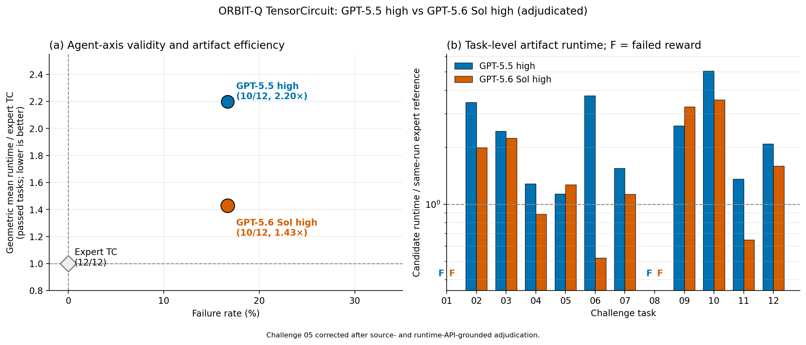
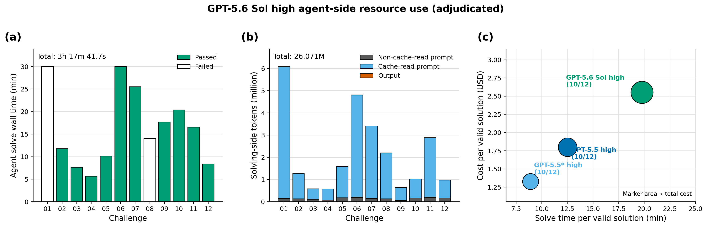
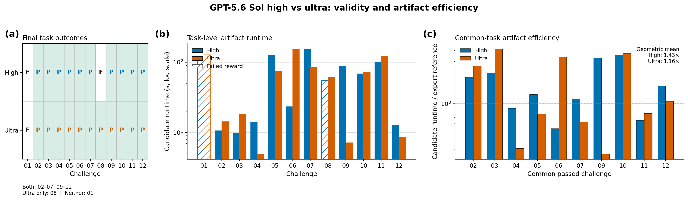
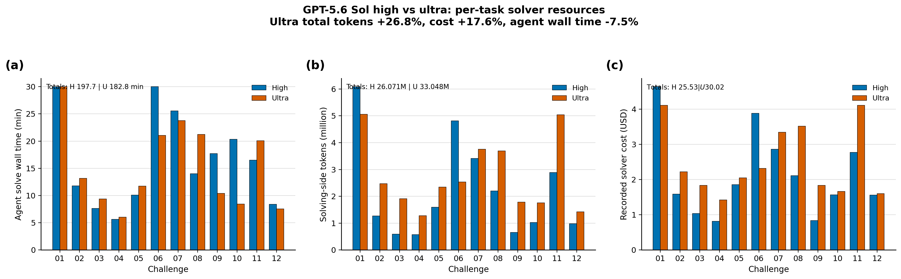
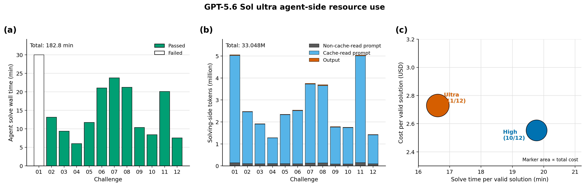
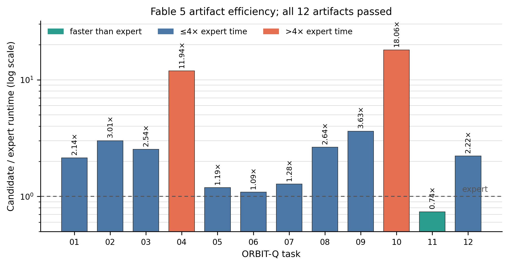
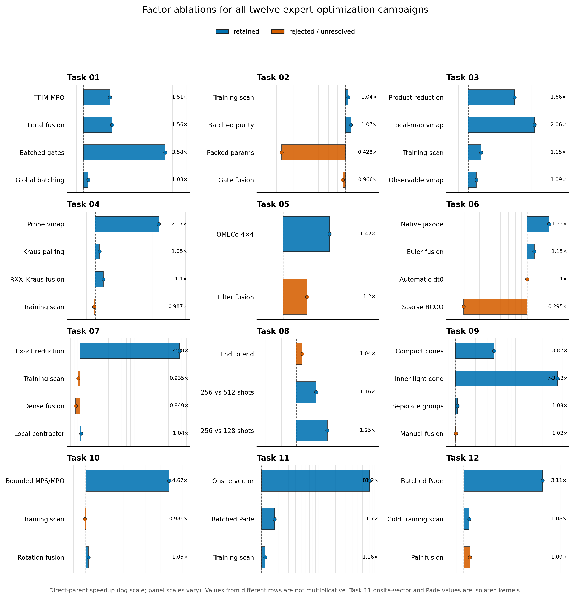

# OrbitBreakersBench

## What we learned from benchmarking agents—and then optimizing the experts

OrbitBreakersBench is the evidence repository behind a series of experiments
on the twelve TensorCircuit-NG tasks in
[ORBIT-Q](https://github.com/sxzgroup/ORBIT-Q). The work asked four related
questions:

1. How well do Fable 5 and GPT-5.6 Sol solve the tasks under semantic
   verification?
2. Does increasing GPT-5.6 Sol reasoning effort from `high` to `ultra`
   improve the result?
3. How much faster can the public human-expert implementations become when a
   human and an AI profile, ablate, and rewrite them together?
4. What do failures, false rejections, memory limits, and challenge-design
   loopholes reveal about the benchmark itself?

The short answer is that validity, artifact efficiency, and expert
co-optimization are different axes:

- **Fable 5 reached 12/12**, but through a hybrid workflow whose solver-side
  resource use is not directly comparable with an in-container agent run.
- **GPT-5.6 Sol high reached 10/12 and ultra reached 11/12** after correcting
  a Task 07 verifier false negative. Ultra solved every task high solved and
  additionally passed Task 08.
- **Ten ordinary expert-optimization campaigns produced statistically
  supported speedups** with a descriptive geometric mean of **2.88x**.
  Task 07 separately exposed a **45.76x exact challenge-design reduction**,
  while Task 08 established bounded-memory feasibility rather than a
  statistically confirmed runtime gain.
- The largest gains usually came from **changing the exact tensor-network
  representation before contraction**, not from generic advice such as
  “always fuse gates” or “always put the optimizer in a scan.”

This README is the human-facing synthesis. The repository retains the
task-level source, immutable references, paired measurements, ablations,
equivalence checks, and experiment ledgers needed to audit those conclusions.
The original operational documentation is preserved in
[`BENCHMARKING.md`](BENCHMARKING.md).

## 1. Evidence model

Three quantities must not be conflated.

| Axis | Question | Metric used here |
|---|---|---|
| Validity | Did the artifact solve the intended task without bypassing the required framework or semantics? | `functional × static policy × LLM audit` |
| Agent artifact efficiency | How slow is a generated valid artifact relative to the expert on the same machine? | `T_candidate / T_reference`; lower is better |
| Expert co-optimization | How much faster is an optimized expert-derived implementation under matched conditions? | paired `T_expert / T_optimized`; higher is better |

Runtime is reported separately from pass/fail reward. For expert
co-optimization, reference and candidate run in alternating order on the same
machine and software environment, with fresh evaluator processes. The
task-level reports retain every pair, mean, median, uncertainty estimate,
validity result, and source hash.

Absolute runtimes from different tasks or hosts are not pooled. The aggregate
ratios below are descriptive summaries of within-task comparisons, not claims
that one machine or one quantum workload is intrinsically faster than another.

## 2. Agent benchmark results

### GPT-5.6 Sol high: 10/12, with faster valid artifacts than GPT-5.5 high

The [GPT-5.6 Sol high benchmark PR](https://github.com/sxzgroup/ORBIT-Q/pull/5)
used one clean Harbor trial per task, no retries, and `high` effort for both
solver and audit.

| Result | GPT-5.6 Sol high |
|---|---:|
| Functional checks | 12/12 |
| Static-policy checks | 12/12 |
| Final semantic audits / rewards | **10/12** |
| Failed tasks | 01, 08 |
| Passed-task geometric-mean slowdown | **1.428x** |
| Solving-side tokens | 26.071 M |
| Recorded cost | USD 25.53 |
| Agent solve wall time | 197.70 min |

The benchmark view reproduces the ORBIT-Q agent-axis presentation. Panel (a)
places final validity beside the geometric-mean slowdown of valid artifacts;
panel (b) shows every task-level candidate/reference runtime ratio and marks
failed rewards explicitly. GPT-5.5 high and GPT-5.6 Sol high both reached
10/12, while the slowdown moved from 2.197x to 1.428x.

The resource view reports per-task agent wall time, prompt/cache/output token
composition, and cost versus solve time per valid solution. GPT-5.6 Sol high
used 197.70 minutes, 26.071 million solving-side tokens, and USD 25.53 in
recorded solver cost.

GPT-5.5 high and GPT-5.6 Sol high both produced ten valid solutions. The
paper's GPT-5.5 high row had a 2.197x passed-task geometric-mean slowdown,
versus 1.428x for GPT-5.6 Sol high. Under this normalized but not fully
controlled comparison, the GPT-5.6 artifacts were about **35% closer to the
expert runtime baseline**.

The comparison is informative rather than causal: the two model generations
used different hosts, benchmark revisions, and audit procedures. Normalizing
each candidate to a same-run expert reduces hardware confounding but cannot
remove every difference.

### GPT-5.6 Sol ultra: 11/12 after Task 07 adjudication

The [GPT-5.6 Sol ultra benchmark PR](https://github.com/sxzgroup/ORBIT-Q/pull/6)
changed solver effort to `ultra` while keeping the audit at `high`. That PR
retains the original 10/12 audit output; the table below reports the final
11/12 result after the Task 07 source-level adjudication documented here and
in the later reduction study.

#### Task-level validity and artifact runtime

| Task | High final | Ultra final | High runtime (s) | Ultra runtime (s) |
|---:|---:|---:|---:|---:|
| 01 | Fail | Fail | 107.51 | 127.87 |
| 02 | Pass | Pass | 10.65 | 14.32 |
| 03 | Pass | Pass | 9.84 | 18.45 |
| 04 | Pass | Pass | 14.14 | 4.96 |
| 05 | Pass | Pass | 124.92 | 75.51 |
| 06 | Pass | Pass | 23.39 | 152.16 |
| 07 | Pass | **Pass†** | 155.52 | 84.99 |
| 08 | Fail | Pass | 55.48 | 60.94 |
| 09 | Pass | Pass | 87.31 | 7.18 |
| 10 | Pass | Pass | 68.68 | 71.27 |
| 11 | Pass | Pass | 100.41 | 120.07 |
| 12 | Pass | Pass | 12.85 | 8.61 |
| **Final validity / mean runtime** | **10/12** | **11/12** | **64.23 mean** | **62.19 mean** |

† Post-hoc source adjudication; the original Ultra reward and audit artifacts
remain unchanged.

The detailed outcome view shows all twelve pass/fail decisions, both raw
artifact runtimes, and same-reference efficiency on the ten tasks passed by
both efforts. Ultra contains every High pass, adds Task 08, and shares only
the Task 01 failure.

#### Solver-resource comparison

| Metric | High | Ultra | Ultra − High |
|---|---:|---:|---:|
| Final valid solutions | 10 | 11 | +1 |
| Agent solve wall time | 197.70 min | 182.80 min | -7.5% |
| Non-cache-read input tokens | 1.709 M | 1.312 M | -23.2% |
| Cache-read input tokens | 24.199 M | 31.478 M | +30.1% |
| Output tokens | 0.163 M | 0.257 M | +58.1% |
| Total solving-side tokens | 26.071 M | 33.048 M | +26.8% |
| Recorded solver cost | USD 25.53 | USD 30.02 | +17.6% |
| Cost per valid solution | USD 2.55 | USD 2.73 | +6.9% |
| Solve time per valid solution | 19.77 min | 16.62 min | -15.9% |
| All-artifact runtime total | 770.70 s | 746.33 s | -3.2% |

This view exposes where the aggregate changes came from: per-task agent wall
time, solving-side tokens, and recorded solver cost do not move uniformly
with reasoning effort.

The standalone Ultra view uses the same resource accounting as the High
figure. It records 182.80 agent minutes, 33.048 million solving-side tokens,
USD 30.02 total cost, and the final 11/12 adjudicated validity.

Ultra used **26.8% more tokens** and cost **17.6% more**, while its agent wall
time was **7.5% shorter** and it produced one additional valid solution.
Cost per valid solution increased by **6.9%** (USD 2.55 to USD 2.73), while
agent wall time per valid solution fell by **15.9%** (19.77 to 16.62 min).
Across the ten tasks passed by high—and also passed by ultra—the geometric
mean of `ultra_runtime / high_runtime` was **0.815**. On that same common set,
the expert-normalized geometric-mean slowdown improved from **1.428x** for
high to **1.165x** for ultra. Task 08 is excluded from the latter comparison
because the contemporaneous expert reference did not fit the original
memory allocation.

Two adjudications are central to the final 11/12 result:

- **Task 07:** the original semantic audit rejected ultra for sampling the
  branches once and then reusing them. A later exact reduction analysis
  showed that this was a false negative. With fixed uniforms, the only
  parameters that affect the branch distribution are the ancilla rotation
  angles; their pathwise derivative through the discrete samples is exactly
  zero, so they do not update and the realized branches remain unchanged.
  Ultra's analytic branch reuse therefore preserves this benchmark
  trajectory rather than replacing it.
- **Task 08:** high used fixed Sobol quasi-samples and was rejected. Ultra
  constructed TensorCircuit probability networks and used a
  Metropolis-Hastings correction, yielding a valid sampler.
- **Task 01:** both efforts capped MPS bond dimension after two-qubit gates.
  The audit correctly treated the unrequested truncation as a change to the
  prescribed ansatz.

This single-run comparison supports a narrower conclusion: ultra explored a
strategy that solved the additional Task 08, while consuming more tokens and
money. It is not enough evidence to infer a general effort-scaling law.

### Fable 5: 12/12 under a hybrid solving protocol

The [Fable 5 benchmark PR](https://github.com/sxzgroup/ORBIT-Q/pull/4)
contains a complete twelve-task row:

| Result | Value |
|---|---:|
| Final official reward | **12/12** |
| Median artifact/runtime ratio | **2.39x expert runtime** |
| Best ratio | **0.74x** |
| Worst ratio | **18.06x** |
| Required framework | TensorCircuit-NG |

The verifier side was official: every solution passed the unchanged
functional evaluator, static policy, and Codex semantic audit. The solver
side was not the standard Harbor agent axis: Fable 5 ran through Cursor over
the workspace, while access to tests and expert solutions was controlled by a
documented discipline protocol rather than physical container isolation.
Therefore:

- artifact validity and same-machine `T/T_ref` remain useful;
- solver tokens, cost, and solve wall time are **not** comparable with the
  in-container Codex runs;
- 12/12 is evidence that the task set is solvable by this model/tool
  combination, not a clean model-only leaderboard result.

The run also quantified a framework-compliance boundary. A Task 04 prototype
built a numerically correct Kraus network from raw tensor-network nodes, but
the semantic audit rejected it as a framework bypass. The TensorCircuit-native
rewrite passed and was roughly four times slower. This “compliance tax” is a
real benchmark outcome: mathematical correctness alone is insufficient when
the task is intended to measure use of a particular framework.

## 3. Human expert + AI co-optimization

The expert campaigns started from immutable public solutions, profiled cold
end-to-end execution, changed one factor at a time where possible, checked
numerical equivalence, and promoted only evaluator-valid candidates.

Bars show mean end-to-end evaluator runtime on a logarithmic scale. Values
above the individual bars are seconds; bold labels are the predeclared means
of paired speedups, so they can differ slightly from the ratio of the two
displayed means when run-to-run noise is asymmetric.

| Task | Mean runtime: expert → optimized | Paired result | Main defensible insight |
|---:|---:|---:|---|
| [01](research/task-01/IMPLEMENTATION_COMPARISON.md) | 60.651 → 6.360 s | **9.636x**, 95% CI 8.681–10.592 | Batch exact gate construction and reduce the Hamiltonian to one bond-3 MPO before contraction. |
| [02](research/task-02/IMPLEMENTATION_COMPARISON.md) | 4.495 → 4.031 s | **1.116x**, CI 1.058–1.174 | A whole-training scan helps modestly; the stronger retained secondary factor is batched exact purity. |
| [03](research/task-03/IMPLEMENTATION_COMPARISON.md) | 4.101 → 0.925 s | **4.435x**, CI 4.287–4.584 | Post-selection makes the surviving state an exact product over six local maps; vectorizing those maps is the largest isolated gain. |
| [04](research/task-04/IMPLEMENTATION_COMPARISON.md) | 14.742 → 5.672 s | **2.602x**, CI 2.529–2.675 | `K.vmap` over four exact probe networks dominates; exact channel and RXX/Kraus fusion add smaller gains. |
| [05](https://github.com/sxzgroup/ORBIT-Q/pull/19) | 115.708 → 60.114 s | **1.939x** mean, **1.668x** median | The revised fully TensorCircuit-native solution is stabilized by a larger OMECo path-search budget; isolated gate fusion is unresolved. |
| [06](research/task-06/IMPLEMENTATION_COMPARISON.md) | 41.426 → 27.537 s | **1.504x**, CI 1.489–1.520 | TensorCircuit's `jaxode` backend is the dominant factor; Euler fusion is only a small compile-oriented refinement. |
| [07](research/task-07/CLASSICAL_ANCILLA_REDUCTION_REPORT.md) | 140.076 → 3.071 s | **45.758x**, CI 39.385–52.131 | Exact challenge-design reduction: 64 measured 16-qubit trajectories collapse to two weighted 8-qubit circuits. |
| [08](research/task-08/IMPLEMENTATION_COMPARISON.md) | 126.675 → 123.188 s | 1.045x, CI 0.818–1.273 | No confirmed runtime gain; contiguous 256-shot batching converts 0/5 OOM into 5/5 PASS under 7 GiB. |
| [09](research/TASK_09_CAUSAL_CONE_COMPARISON.md) | 33.504 → 8.767 s | **3.822x**, CI 3.730–3.914 | Prune the exact causal cone before TensorCircuit graph construction, then retain the framework's inner light-cone cancellation. |
| [10](research/task-10/IMPLEMENTATION_COMPARISON.md) | 18.931 → 3.869 s | **4.898x**, CI 4.598–5.199 | Use the exact low-rank MPS/MPO structure of the two CMZ reflections instead of repeated generic path search. |
| [11](research/task-11/IMPLEMENTATION_COMPARISON.md) | 168.362 → 114.968 s | **1.464x**, CI 1.457–1.472 | Reduce dense-state passes and replace twelve diagonal onsite expectations with one coefficient-vector contraction. |
| [12](research/task-12/IMPLEMENTATION_COMPARISON.md) | 9.083 → 2.321 s | **3.914x**, CI 3.877–3.951 | Batch the 31 fixed-order SU4 exponentials; this is the promoted primary candidate, not the secondary fused variant. |

### Combined factor ablations

Each panel summarizes the task's direct factor-removal or matched-parent
experiment. Blue factors were retained; orange factors were rejected or
remain statistically unresolved. The horizontal distance from `1x` shows the
measured effect of adding that factor to its direct parent. Panel scales vary,
and values from separate rows must not be multiplied. Task 11's onsite-vector
and Pade measurements are isolated kernels; the task-level reports linked in
the table retain the complete paired data, confidence intervals, and
experiment context.

Ten ordinary, statistically supported speedups—Tasks 01–06 and 09–12—have
an unweighted descriptive geometric mean of **2.88x**. Task 07 is excluded
from that number because it is a benchmark-design reduction, and Task 08 is
excluded because its high-memory runtime interval crosses one.

Two rows require special care:

- **Task 05 supersession.** An earlier 14.08x exact-MPS result put the core
  state update and expectation contractions in handwritten backend einsums.
  It is excluded from the compliant headline. The table uses the later
  TensorCircuit-owned circuit/MPO implementation. Its five-pair mean is
  affected by one 180.22 s expert long tail; the four-pair sensitivity
  estimate is 1.639x, still directionally consistent with the 1.668x median.
- **Task 08 feasibility.** The expert was never algorithmically impossible.
  It failed because the original 8192-shot `vmap` requested 9–18 GiB buffers
  inside a 7-GiB allocation. A 64-GiB five-pair run proved that both expert
  and candidate pass; it did not establish a significant runtime difference.

The task-level factor plots matter because cumulative speedups are otherwise
easy to misattribute. Examples include:

- whole-training scan was helpful on Tasks 02, 03, 11, and 12, but neutral or
  harmful in several other graphs;
- fewer gate nodes did not guarantee faster contractions on Tasks 02, 08,
  and 10;
- larger contraction-path searches helped Task 05, while smaller searches
  helped Tasks 01 and 07;
- structurally shrinking the exact state or causal cone dominated local
  micro-optimizations on Tasks 03, 07, 09, and 10.

## 4. Findings about benchmark design and measurement

### Visible correctness is not semantic correctness

Both GPT-5.6 effort levels passed functional and static checks on all twelve
tasks, but final adjudicated validity was 10/12 for high and 11/12 for ultra.
Task 01's truncation and high Task 08's quasi-sampling satisfy many
output-level checks while changing the requested computation.

This supports a layered verifier: functional tests detect output failures,
static policy rejects obvious bypasses, and semantic source audit checks
whether the computation still represents the task.

### Semantic audits can also be wrong

Two source audits produced false negatives:

- **High Task 05** was initially rejected because the audit assumed
  TensorCircuit's `exp1` always uses a half-angle convention. In the pinned
  package, `exp1(..., half=False)` is the default; direct matrix checks
  matched the required filters to approximately `10^-8`.
- **Ultra Task 07** was rejected for freezing its sampled branches. Exact
  analysis showed that the ancilla sampling angles have zero pathwise
  gradient for the fixed discrete trajectories and therefore stay at their
  initial values. The same realized branches are consequently valid across
  all optimizer updates.

Both results were adjudicated from failure to pass while preserving the
original audit artifacts.

The lesson is not to remove semantic audit, but to make adjudication
reproducible: retain the original decision, record the exact package version,
and support a correction with direct API-level evidence.

### Task 07 exposes a real loophole

The public fixed trajectories and diagonal ancilla interactions allow exact
classical elimination of the measured register. Under the executable
contract, the 45.76x reduction is valid. Under the likely intent—to benchmark
TensorCircuit mid-circuit measurement—it is a loophole because the candidate
no longer executes the 16-qubit measured circuit.

The conservative full-register alternative still achieves **4.479x** paired
speedup. A future task revision should require framework-native mid-circuit
measurement in the timed region or introduce interactions for which ancilla
measurement probabilities genuinely depend on the data state.

### The harness itself required auditing

The experiments identified two infrastructure defects:

1. The documented reward formula excluded runtime, but the scorer still
   multiplied by `runtime_score`. A fully valid slow solution could therefore
   receive a fractional reward. The scorer was synchronized with the
   documented policy while preserving runtime as a separate field.
2. The pinned TensorCircuit nightly predated the public OMECo integration
   required by expert references. The framework pin was updated so all twelve
   references could run unchanged.

These are not incidental engineering notes. A benchmark result is only as
credible as the versioned harness that produces it.

## 5. What these results support

The combined evidence supports four conclusions:

1. **The benchmark separates validity from speed.** A model can produce a
   fast invalid shortcut, a slow valid solution, or a valid solution faster
   than the expert.
2. **Human–AI collaboration improves both implementations and evaluation.**
   Profiling found substantial exact speedups, while adversarial optimization
   exposed under-specified semantics and resource assumptions.
3. **More reasoning changed both coverage and resource use in this run.**
   Ultra preserved all ten high passes, added Task 08, used 26.8% more tokens,
   and cost 17.6% more.
4. **Ablation is necessary for useful take-home messages.** Many plausible
   edits contributed little, interacted with graph structure, or regressed.
   The retained reports identify the dominant factor instead of crediting
   every code change.

## 6. Reproducibility and evidence index

- Benchmarking and environment guide: [`BENCHMARKING.md`](BENCHMARKING.md)
- Reusable expert-optimization workflow:
  [`autoresearch/EXPERT_OPTIMIZATION_WORKFLOW.md`](autoresearch/EXPERT_OPTIMIZATION_WORKFLOW.md)
- Benchmark protocol:
  [`research/BENCHMARK_PROTOCOL.md`](research/BENCHMARK_PROTOCOL.md)
- Per-task experiment ledgers and comparisons: [`research/`](research/)
- Immutable public experts: [`references/`](references/)
- Optimized implementations: [`src/solutions/`](src/solutions/)
- Public workloads and evaluator copies: [`datasets/`](datasets/) and
  [`tasks/`](tasks/)
- Fable 5 evidence PR: [sxzgroup/ORBIT-Q#4](https://github.com/sxzgroup/ORBIT-Q/pull/4)
- GPT-5.6 Sol high evidence PR:
  [sxzgroup/ORBIT-Q#5](https://github.com/sxzgroup/ORBIT-Q/pull/5)
- GPT-5.6 Sol ultra evidence PR:
  [sxzgroup/ORBIT-Q#6](https://github.com/sxzgroup/ORBIT-Q/pull/6)
- Task 07 design-reduction discussion:
  [sxzgroup/ORBIT-Q#7](https://github.com/sxzgroup/ORBIT-Q/pull/7)
- Revised TensorCircuit-native Task 05 evidence:
  [sxzgroup/ORBIT-Q#19](https://github.com/sxzgroup/ORBIT-Q/pull/19)

All headline performance claims are tied to evaluator-passing artifacts.
Where a result is descriptive, resource-limited, adjudicated, local-engine
only, or dependent on the executable rather than intended contract, the
qualification is part of the result rather than a footnote to be omitted.
