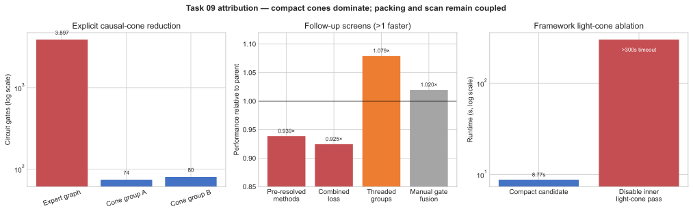

# Task 09: Random Local Light-Cone Optimization

Date: 2026-07-28

Base commit: `d612cd3ae752a8d16fd0b59c717d19abd4fb5f38`

This report compares the reference and candidate and audits semantic
preservation.

## Result

The Task 09 candidate reduces evaluator-reported runtime from `67.624470` to
`18.204267` seconds in one matched Docker pair. Both processes passed the
functional evaluator. The measured speedup is `3.714759x`, or a `73.080355%`
runtime reduction.

| Measurement | Reference | Candidate |
| --- | ---: | ---: |
| Evaluator runtime | 67.624470 s | 18.204267 s |
| Observable history shape | `(200, 100)` | `(200, 100)` |
| Mean initial objective | -0.0022892463 | -0.0022892461 |
| Mean final objective | 1.5645751637 | 1.5645751691 |
| Final variance | 1.1838657734e-10 | 1.1816455867e-10 |
| Best final objective | 1.5645909309 | 1.5645909309 |
| Success fraction | 1.000000 | 1.000000 |
| Evaluator result | PASS | PASS |

One matched pair cannot establish a confidence interval. Treat the timing as
engineering evidence for the implementation, not as a promotion measurement.
The benchmark protocol requires at least six matched pairs for a reportable
runtime claim.

## Semantic audit

Audit result: **PASS after one documentation correction**.

The first candidate revision changed the module docstring title from
`random local light-cone optimization` to `compact causal-cone optimization`.
The evaluator ignores the docstring. The edit still renamed the problem and
could mislead a reviewer about the task. We restored the original title and
description verbatim in the candidate.

### Changed-file boundary

The branch changes two files:

| Path | Change |
| --- | --- |
| `src/solutions/task-09/solution_9.py` | Replaces the execution strategy while preserving `run_solution(config)` and the output contract |
| `research/TASK_09_CAUSAL_CONE_COMPARISON.md` | Records the code comparison, experiments, and audit |

The branch does not change these authoritative files:

| Authority | Audit result |
| --- | --- |
| `tasks/task-09/problem.md` | Unchanged |
| `tasks/task-09/evaluator/evaluate_9.py` | Unchanged |
| `tasks/task-09/task.toml` | Unchanged |
| `references/task-09/solution_9.py` | Unchanged |
| Gate-tape generator, Pauli terms, seeds, and validity rules | Unchanged |

### Requirement-by-requirement audit

| Requirement | Candidate behavior | Result |
| --- | --- | --- |
| Problem identity | Uses the original `Task Suite Problem 9: random local light-cone optimization` module title and description | PASS |
| Framework | Builds each retained circuit with `tc.Circuit` and evaluates it with `expectation_ps` | PASS |
| Initial state | Applies Hadamard gates to every qubit in each exact backward cone; qubits outside the cone factor out of the local expectation | PASS |
| Gate tape | Derives gates, qubits, axes, and parameter indices from `config["gate_tape"]` | PASS |
| Gate semantics | Calls the same TensorCircuit gate methods with the same `theta` values as the reference | PASS |
| Objective | Uses every supplied coefficient and Pauli term, then returns the negative objective as the loss | PASS |
| Random initialization | Generates each full 3,897-coordinate seeded row before gathering active coordinates | PASS |
| Restarts | Evaluates all `config["n_restarts"]` rows through `vmap` | PASS |
| Adam | Preserves learning rate, betas, epsilon, moment updates, and bias correction | PASS |
| Update count | Runs `config["max_steps"]` updates and does not stop before the final update | PASS |
| History timing | Records each objective before applying its Adam update | PASS |
| Output | Returns `observable_history` as a NumPy array with shape `(n_restarts, max_steps)` | PASS |
| Hardcoding | Discovers cone membership and parameter overlap from the supplied tape; does not encode public qubit positions or expected answers | PASS |

### Did the optimization change the problem meaning?

No. The candidate changes the representation and execution order of the same
unitary expectation calculation.

The reference evaluates

$$
\langle + | U^\dagger O U | + \rangle
$$

after constructing all gates. The candidate cancels gates outside the exact
backward connectivity cone before constructing TensorCircuit nodes. Those
gates appear as matching \(G^\dagger G\) pairs outside the support of \(O\).
Removing them leaves the local expectation and its active gradients
unchanged.

The candidate also removes inactive coordinates from its Adam arrays.
Inactive gradients equal zero, so their moments remain zero and their
parameters never change. The task does not request final parameters. It
requests the objective history, which depends on active coordinates.

The two public cones have disjoint parameter sets. Adam updates each coordinate
from that coordinate's gradient and moments, so separate scans produce the
same updates as one combined scan. The code groups intersecting cones when a
future supplied tape contains parameter overlap.

### Did the optimization twist the answer?

No. We compared all 20,000 values in the full reference and candidate
`(200, 100)` histories under one finalized configuration:

The comparison used candidate SHA-256
`2a4ef26d06a3989474ae08f753a6444ec755fb7647ef1f393f386aaa21089d4d`.

| Answer-integrity check | Result |
| --- | ---: |
| Reference shape | `(200, 100)` |
| Candidate shape | `(200, 100)` |
| Numerical comparison at `rtol=1e-6`, `atol=1e-6` | PASS |
| Maximum absolute difference | `1.1920928955078125e-7` |
| Mean absolute difference | `2.7951091760769487e-8` |
| Maximum initial-column difference | `7.450580596923828e-9` |
| Maximum final-column difference | `1.1920928955078125e-7` |
| Reference mean final objective | `1.5645751637220382` |
| Candidate mean final objective | `1.5645751690864562` |
| Best final objective | `1.5645909309387207` for both |
| Success fraction | `1.0` for both |

The histories are not bitwise equal. JAX traces the compact disjoint scans with
a different floating-point operation order, which changes some float32 values
by one unit in the last place. The largest observed difference,
`1.1920928955078125e-7`, equals one float32 spacing near values of order one.
The numerical trajectory, optimization result, and evaluator decision agree.

### Audit limits

The elementwise history comparison provides stronger semantic evidence than
the evaluator's aggregate checks. It does not prove equivalence for gate types
outside the task contract. The supplied gate set contains unitary `rx`, `ry`,
`rz`, `rxx`, `ryy`, and `rzz` operations, which support the cancellation used
by the candidate.

The `.understand-anything/knowledge-graph.json` file was absent during this
audit, so we could not generate a graph-based blast-radius overlay. The direct
Git diff shows a two-file branch scope, and the authoritative task and
reference surfaces remain unchanged.

## Code comparison

The immutable
[reference](../references/task-09/solution_9.py#L45) constructs a 512-qubit
TensorCircuit circuit, applies 512 Hadamards and all 3,897 parameterized gates,
then asks `expectation_ps` to cancel the irrelevant circuit for each Pauli
term. The reference also keeps 3,897 parameters and two Adam moment arrays for
each of 200 restarts. A Python loop dispatches the jitted optimizer step 100
times.

The reference constructs the full circuit before TensorCircuit sees an
observable:

```python
# references/task-09/solution_9.py
circuit = tc.Circuit(config["n_qubits"])
for qubit in range(config["n_qubits"]):
    circuit.h(qubit)

for gate in gate_tape:
    if len(gate) == 3:
        getattr(circuit, gate[0])(gate[1], theta=params[gate[2]])
    else:
        getattr(circuit, gate[0])(
            gate[1], gate[2], theta=params[gate[3]]
        )
```

It then evaluates both terms from that 512-qubit circuit:

```python
for coeff, (xs, ys, zs) in pauli_data:
    total += coeff * K.real(
        circuit.expectation_ps(
            x=xs,
            y=ys,
            z=zs,
            enable_lightcone=True,
        )
    )
```

For an observable \(O\), TensorCircuit contracts the expectation network:

$$
\langle O \rangle = \langle 0 | U^\dagger O U | 0 \rangle.
$$

The network contains a ket copy of \(U\) and a conjugate bra copy of
\(U^\dagger\). With `enable_lightcone=True`, TensorCircuit cancels matching
gate pairs outside the backward influence of \(O\). Those pairs contribute
\(G^\dagger G = I\), so their removal preserves the expectation value. In the
reference, TensorCircuit performs this cancellation after Python has created
all 512 qubits and 3,897 gates.

The [candidate](../src/solutions/task-09/solution_9.py#L32) changes that path:

1. `extract_cone` scans the supplied gate tape backward from each measured
   Pauli support.
2. The scan retains a one-qubit gate when its qubit belongs to the current
   support. It retains a two-qubit gate when either endpoint belongs to the
   support, then adds both endpoints.
3. The candidate maps the retained qubits to compact indices and builds one
   TensorCircuit circuit per Pauli term.
4. The candidate gathers the union of active parameter indices after
   generating each full seeded initialization row.
5. `parameter_groups` separates terms whose active parameter sets do not
   intersect.
6. One jitted `jax.lax.scan` executes all 100 Adam updates for each parameter
   group.
7. TensorCircuit still applies `enable_lightcone=True` to each compact circuit.

The candidate performs the first pruning pass on the framework-neutral tape:

```python
# src/solutions/task-09/solution_9.py
support = {qubit for _, qubit in term}
retained = []

for gate in reversed(gate_tape):
    if len(gate) == 3:
        relevant = gate[1] in support
    elif len(gate) == 4:
        relevant = gate[1] in support or gate[2] in support
        if relevant:
            support.update((gate[1], gate[2]))
    else:
        raise ValueError(f"Invalid gate-tape entry: {gate}")
    if relevant:
        retained.append(gate)
```

It constructs a TensorCircuit circuit from the retained gates and asks
TensorCircuit to simplify the remaining expectation network:

```python
total = 0.0
for cone in cones:
    circuit = tc.Circuit(cone["n_qubits"])
    for qubit in range(cone["n_qubits"]):
        circuit.h(qubit)
    for gate in cone["gates"]:
        if len(gate) == 3:
            getattr(circuit, gate[0])(
                gate[1], theta=params[positions[gate[2]]]
            )
        else:
            getattr(circuit, gate[0])(
                gate[1], gate[2], theta=params[positions[gate[3]]]
            )
    xs, ys, zs = cone["paulis"]
    total += cone["coeff"] * K.real(
        circuit.expectation_ps(
            x=xs,
            y=ys,
            z=zs,
            enable_lightcone=True,
        )
    )
```

The two code paths use separate cancellation stages:

| Stage | Code owner | Removed work |
| --- | --- | --- |
| Backward gate-tape scan | Candidate | Gates and qubits outside the connectivity cone, before TensorCircuit graph construction |
| `enable_lightcone=True` | TensorCircuit | Redundant bra-ket structure in the compact expectation network, before contraction |

Removing `enable_lightcone=True` from the second code block produced the
300-second timeout recorded below. The explicit tape scan cuts graph
construction from 3,897 gates to 74 and 80 gates. TensorCircuit's cancellation
then makes the remaining doubled networks cheap enough for 200 restarts and
100 optimizer steps.

The public tape produces these structures:

| Observable | Reference circuit | Compact circuit | Retained gates | Active parameters |
| --- | ---: | ---: | ---: | ---: |
| `X_388 Z_390` | 512 qubits | 18 qubits | 74 | 74 |
| `X_16 Y_19` | 512 qubits | 15 qubits | 80 | 80 |

The parameter sets do not overlap. The candidate therefore trains two
independent 74- and 80-coordinate problems and sums their pre-update objective
histories.

## Why the transformation preserves the task

Unitaries outside a local observable's backward causal cone cancel between the
ket and bra networks. Removing those gates before TensorCircuit graph
construction leaves the observable and its active gradients unchanged.

The initialization path generates the same 3,897-element NumPy row as the
reference for every restart and gathers the active entries afterward. Drawing
154 values would assign different random values to the scattered active
indices, so the candidate does not use that shortcut.

Parameters outside both cones have zero gradients. Their Adam moments remain
zero and their values do not change. Adam updates each coordinate from its own
gradient and moment state, so parameter-disjoint loss terms can run in
separate scans. The candidate combines terms into one group when their
parameter sets overlap.

`jax.lax.scan` preserves the reference update order. Each history entry still
records the objective before its corresponding Adam update. The candidate
returns the required `(n_restarts, max_steps)` NumPy array.

The packed parameter, first-moment, and second-moment arrays contain 25.3 times
fewer coordinates:

```text
3897 / 154 = 25.305
```

For 200 restarts in float32, those three persistent arrays shrink from about
8.92 MiB to 0.35 MiB. This figure excludes compiled intermediates and
TensorCircuit contraction storage.

## Effort record

### 1. Structural inspection

We inspected the evaluator, gate-tape generator, reference solution, output
contract, and optimizer schedule. A reverse connectivity scan reproduced the
reported 18- and 15-qubit cone sizes. It retained 74 and 80 gates, with no
shared parameter indices.

### 2. First compact implementation

The first candidate implemented backward-cone extraction, compact qubit
mapping, active-coordinate gathering, parameter-overlap grouping, and a
whole-training `jax.lax.scan`. It disabled TensorCircuit's automatic
light-cone cancellation because the input graph had already been pruned.

A two-restart, two-step comparison completed:

| Measurement | Reference | First candidate |
| --- | ---: | ---: |
| Runtime | 47.230586 s | 16.056370 s |
| Maximum history difference |  | 7.450581e-7 |
| `rtol=1e-6`, `atol=1e-6` |  | PASS |

We found a performance regression in the full public run. The reference passed
in `98.805672` seconds, while the candidate hit the 300-second timeout. The
failed candidate had source SHA-256
`2a49a983a2370e79640107d2c92b42628d4de1ad4be6c96ef84b5003c6058ade`.

### 3. Contraction-path correction

The compact circuit still creates a doubled tensor network for expectation
evaluation. Graph-level connectivity pruning did not remove enough work from
that network at 200-way vectorization. We restored
`enable_lightcone=True` on each compact circuit.

The corrected two-restart, two-step history matched the saved reference values
with a maximum absolute difference of `3.727175e-9`. The corrected candidate
completed that smoke run in `17.834426` seconds.

### 4. Full validation

A standalone full candidate run passed in `14.820049` seconds. We then ran one
fresh reference-to-candidate pair in the same staged task container:

```bash
./bench run 09 \
  --solution optimized \
  --compare-to reference \
  --repeat 1 \
  --engine docker \
  --timeout 300 \
  --no-build
```

The reference passed in `67.624470` seconds. The candidate passed in
`18.204267` seconds. The benchmark reported `3.714759x` paired speedup and
`73.080355%` improvement.

Static validation also passed:

```bash
python3 -m py_compile src/solutions/task-09/solution_9.py
git diff --check
./bench verify
```

The candidate contains 155 non-empty, non-comment lines, below the task's
200-line policy limit.

### 5. Static gate-method specialization

We tested whether resolving each gate name to an unbound `tc.Circuit` method
during cone extraction would reduce tracing overhead:

```python
# Existing compact representation and trace-time call
compact_gate = (gate_name, qubit, parameter_index)
getattr(circuit, compact_gate[0])(
    compact_gate[1],
    theta=params[position],
)

# Tested representation and trace-time call
compact_gate = (
    getattr(tc.Circuit, gate_name),
    qubit,
    parameter_index,
)
compact_gate[0](
    circuit,
    compact_gate[1],
    theta=params[position],
)
```

The current candidate scans the 3,897-entry tape once per observable before
JAX tracing. A 1,000-iteration microbenchmark measured `0.383707 ms` for both
cone extractions, or about `49.23 ns` per visited tape entry. The candidate
retains 74 and 80 gates, so the string-based `getattr` path runs 154 times
during tracing rather than during the 20,000 optimizer updates.

All 12 method-specialization evaluator cells passed. We measured six
counterbalanced pairs in one pinned Docker container, with a fresh Python
process for each cell:

| Pair | Order | String dispatch | Method specialization | Baseline / specialized |
| ---: | --- | ---: | ---: | ---: |
| 1 | string → method | 7.783336 s | 7.206295 s | 1.080075x |
| 2 | method → string | 7.704271 s | 7.893952 s | 0.975971x |
| 3 | string → method | 8.321220 s | 9.376603 s | 0.887445x |
| 4 | method → string | 8.832963 s | 10.846111 s | 0.814390x |
| 5 | string → method | 9.670592 s | 10.374776 s | 0.932125x |
| 6 | method → string | 10.043432 s | 10.672198 s | 0.941084x |

| Summary | String dispatch | Method specialization |
| --- | ---: | ---: |
| Mean | 8.725969 s | 9.394989 s |
| Median | 8.577092 s | 9.875690 s |
| Pair wins | 5/6 | 1/6 |

The mean paired speedup was `0.938515x` with standard error `0.036288`.
Mean paired improvement was `-7.344123%`, so the prototype regressed. We
discarded it and restored the string-based compact gate representation. The
measurements support two conclusions: the full-tape scan costs less than one
millisecond, and pre-resolving 154 method objects does not reduce end-to-end
runtime in this environment.

## Main findings

### Prune before graph construction

TensorCircuit's automatic cancellation reaches the relevant contraction after
the reference has created thousands of irrelevant gates and their tensor
nodes. A backward gate-tape scan removes that construction cost and gives
TensorCircuit two small circuits.

### Keep TensorCircuit cancellation after pruning

The 300-second timeout provides the strongest ablation in this comparison.
Explicit connectivity pruning and TensorCircuit light-cone cancellation solve
different parts of the cost. The first limits the circuit that enters the
framework. The second simplifies the doubled expectation network inside that
compact circuit. The final candidate needs both.

### Pack inactive optimizer coordinates

Of 3,897 parameters, 154 affect the requested observables. Gathering those
coordinates cuts persistent Adam storage and elementwise optimizer work by
25.3 times while preserving the seeded initial values.

### Exploit separability when the tape permits it

The two public cones share no trainable parameters. Coordinatewise Adam allows
the candidate to train them in separate scans. The code detects overlap from
the supplied tape and combines intersecting terms, so it does not hardcode the
public qubit positions, cone sizes, or separation result.

### Compile the optimizer trajectory as one unit

The reference invokes one jitted step from Python 100 times. The candidate
places the complete Adam trajectory inside one jitted scan and returns the
stacked pre-update history.

### Keep gate names in the compact static tape

JAX traces the 154 compact gate calls once. It does not dispatch them during
each restart or optimizer update. Pre-resolving those strings into unbound
methods lost five of six matched pairs and increased mean runtime by 7.34%.
The candidate therefore keeps the simpler string representation.

## Attribution limits and next checks

The original final timing measures cone extraction, coordinate packing,
separation, and scan together. It must not be quoted as though every bullet
independently contributes `3.82x`. Available removal and follow-up screens now
separate several factors:

| Factor | Ablation evidence | Contribution conclusion |
|---|---|---|
| Explicit pre-construction causal cones | 3,897 gates become 74 and 80; final six-pair candidate is `3.82x` over the expert | Dominant structural factor, but its percentage is coupled to the compact TensorCircuit graph. |
| Inner `enable_lightcone=True` | Removing it after explicit pruning exceeded 300 s | Independently necessary; explicit pruning and framework cancellation solve different costs. |
| Pre-resolved gate methods | Six pairs: `9.395 s` vs `8.726 s`, mean paired ratio `0.9385x` | Negative contribution; rejected. |
| One combined 154-coordinate loss | Three pairs: `7.722 s` vs `7.139 s`, `-8.16%`, 0/3 wins | Group separation is beneficial for this graph; combining losses is worse. |
| Threaded submission of the two groups | Three pairs: `6.900 s` vs `7.447 s`, `+7.34%`, bitwise history | Promising follow-up, not part of this PR's measured candidate. |
| Manual single-qubit run fusion | Six pairs: `1.0197x`, 95% t-CI `[0.9692, 1.0702]`, 3/6 wins | No resolved contribution; rejected. |

The remaining unisolated pieces are active-coordinate packing and
whole-training scan. Packing reduces optimizer arrays from 3,897 to 154
coordinates, a `25.3x` storage/elementwise-work reduction, but no independent
end-to-end percentage is claimed. The scan likewise remains bundled with the
compact optimizer graph. This explicit limit is preferable to assigning the
full `3.82x` to either one.



The figure separates structural graph reduction, measured removal/follow-up
screens, and the inner light-cone timeout. Packing and scan intentionally have
no invented bars because no clean independent timing exists. Regenerate with
[`task-09/plot_factor_ablation.py`](task-09/plot_factor_ablation.py).

The comparison covers the deterministic public Task 09 configuration on one
host and one pinned image. A follow-up performance report should run at least
six counterbalanced pairs and report the mean, median, standard error, pair
wins, and paired-speedup confidence interval. The two still-useful clean
ablations are:

- compact cones with full optimizer coordinates;
- packed coordinates with a Python optimizer loop.

Post-PR screen data are preserved in
[`task-09/profiles/post-pr-factor-screens.json`](task-09/profiles/post-pr-factor-screens.json).

## Provenance

| Artifact | SHA-256 or version |
| --- | --- |
| Reference solution | `b28a9df18a46cb2e211a02bf526f3c3b75a44e11e7d364ec5f81026202d8d1d9` |
| Final candidate solution | `2a4ef26d06a3989474ae08f753a6444ec755fb7647ef1f393f386aaa21089d4d` |
| Task 09 evaluator | `9ae54eed501fa71d985ab92aa3601714f41cf9848bea0014c0d8cfb7c866f58d` |
| Requirements lock | `cd5ac5cb2102ea7b40bd46dc81320cc59e0ce0671ab88c597f81d82b384a824b` |
| Docker image ID | `sha256:623dc47116d71b5f4e2879a61def7beada982438cb2df45de8367d92f7ec242c` |
| TensorCircuit-NG | `1.7.0.dev20260618` |
| JAX/JAXLIB | `0.10.0` |
| CPU and memory limits | 8 CPUs, 9 GiB |
| Evaluator timeout | 300 seconds |

## Follow-up: TC-native APIs + six-pair local remeasure (2026-07-28)

Branch: `cursor/task-09-tc-native-remeasure-f598`

Style-only execution change relative to the merged compact-cone candidate:
replace direct `import jax` / `jax.lax.scan` with TensorCircuit backend
primitives `K.jit` and `K.jaxy_scan`. The cone extraction, active-parameter
packing, disjoint-group Adam protocol, and module docstring are unchanged.

Candidate SHA-256:
`4f95bc939b89c9a1810c7c3e8c8195df11a3d754022bb539004acfd070a76efa`

Host fingerprint matches the Task 11/12 local campaigns
(`748423c1790b38ddbdd8eb77499b222a173b313f350e3bc35402ee8889a49dc4`;
4 vCPU, pinned `envs/tensorcircuit-py311/requirements.lock`,
`--engine local`, no Docker daemon).

Command:

```bash
./bench run 9 --solution optimized --compare-to reference --repeat 6 \
  --engine local --timeout 300 \
  --output results/task-09-tc-native-pairs-local
```

Immutable report SHA-256:
`8199194e197ebae969a51b454620afcc95ececf0dc2b9e78107ff5de2aaf0cba`

Summary SHA-256:
`60c858f0d36df7fa84c1b2d77ce8544642337671e10de640ef1e8ddd29046dff`

```text
terminal_status: SUCCESS x 12
valid: 12/12
passing_pairs: 6/6
reference_mean_runtime_sec: 33.503727
candidate_mean_runtime_sec: 8.766516
speedup: 3.821725
speedup_stderr: 0.035825
paired_speedup_ci_low: 3.729633
paired_speedup_ci_high: 3.913817
```

Decision: `keep` as a TC-native refresh of the merged candidate. The formal
Docker Gate-3 promotion protocol remains deferred on this host.
