# Task 01 TensorCircuit-Native Optimization Report

## Scope and claim

This campaign starts from the immutable bundled Task 01 human expert and
explores the original method freely. The older MPO implementation on `main`
was treated only as historical motivation, not as an accepted parent.

The result is the **Task 01 campaign best under the public evaluator**, not a
claim of global state of the art. No public result supplies a matched Task 01
evaluator, implementation, package set, and hardware allocation.

| Role | Artifact | SHA-256 |
| --- | --- | --- |
| Immutable human expert | [`references/task-01/solution_1.py`](../../references/task-01/solution_1.py) | `80011df1b68a009b489982a8f5c1ec47f693a187f923a5c906fb2b6f4d51c2a1` |
| Campaign best | [`src/solutions/task-01/solution_1.py`](../../src/solutions/task-01/solution_1.py) | `5297b04c4794fb43afa9c391988a9b563c9d44142ce3a622dbfcd8d659b335c4` |
| Sanitized measurements | [`results-20260729/ablation-summary.json`](results-20260729/ablation-summary.json) | `5e6da9e7e369d538092f7262e389594fb209c761e08cf49baba4a1b20854de41` |
| Reference profile | [`profiles/reference-profile.json`](profiles/reference-profile.json) | `d21cac5b49052cbaa3a4bb286bb968682cc5158f7d0e62a8d78ffeda6141f417` |
| Candidate profile | [`profiles/candidate-profile.json`](profiles/candidate-profile.json) | `eeca4de572f324f5063fb4c19dd3b8d376f042eca01e438ef8ef8129a278de34` |
| Final equivalence | [`profiles/final-equivalence.json`](profiles/final-equivalence.json) | `fa694c68c939f67ade456b9f7603045fc585d1975195d2a61df887cf1810ad8e` |
| Evidence ledger | [`LOG.md`](LOG.md) | Append-only experiment history and corrections |
| Reusable workflow | [`autoresearch/EXPERT_OPTIMIZATION_WORKFLOW.md`](../../autoresearch/EXPERT_OPTIMIZATION_WORKFLOW.md) | Gate, profile, ablation, promotion, and PR procedure |

## Final result

Every evaluator cell passed, and the candidate won all six matched alternating
pairs.

| Metric | Human expert | Campaign best |
| --- | ---: | ---: |
| Passing runs | 6/6 | 6/6 |
| Mean runtime | 60.651144 s | 6.359807 s |
| Median runtime | 62.472312 s | 6.586804 s |
| Runtime standard error | 2.438846 s | 0.406252 s |
| Runtime range | 52.975004–66.629479 s | 4.962822–7.558886 s |
| Mean paired speedup | — | **9.636410x** |
| Paired-speedup standard error | — | 0.371756x |
| 95% Student-t interval | — | **8.680782x–10.592037x** |
| Ratio-of-means runtime reduction | — | **89.51%** |

The requested five-run view agrees with the authoritative six-pair result:
the first five pairs average `59.654232 s` for the expert and `6.259794 s`
for the candidate, with `9.650078x` mean paired speedup.

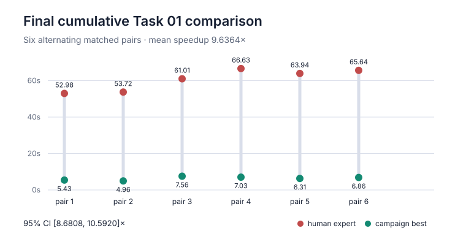

### Matched timings

| Pair | Order | Human expert | Campaign best | Speedup |
| ---: | --- | ---: | ---: | ---: |
| 1 | expert → candidate | 52.975004 s | 5.432733 s | 9.751078x |
| 2 | candidate → expert | 53.722055 s | 4.962822 s | 10.824901x |
| 3 | expert → candidate | 61.008748 s | 7.558886 s | 8.071130x |
| 4 | candidate → expert | 66.629479 s | 7.030792 s | 9.476810x |
| 5 | expert → candidate | 63.935876 s | 6.313737 s | 10.126471x |
| 6 | candidate → expert | 65.635701 s | 6.859870 s | 9.568068x |

The raw final report SHA-256 is
`6c3c31370fedc100e061327e52cbcdcfc6e3709b8ba2b41310e829669a7ab237`.
The tracked summary removes host paths, container names, and machine identity.

## Retained implementation

The final source imports only NumPy, Optax, and TensorCircuit-NG. It does not
import JAX directly or switch quantum frameworks. The differentiable quantum
calculation remains a TensorCircuit `Circuit`, native gate tensors, a
TensorCircuit `QuOperator` MPO, and `mpo_expectation`.

### 1. Replace 63 observables with one exact TFIM MPO

The expert builds 31 `ZZ` and 32 `X` measurement patterns and differentiates
through a separate tensor-network contraction for each pattern. The optimized
implementation expresses the same open-boundary Hamiltonian,

\[
H=-\sum_{i=0}^{30} Z_i Z_{i+1}-1.05\sum_{i=0}^{31}X_i,
\]

as a bond-dimension-three MPO with the bulk operator block

\[
W=
\begin{pmatrix}
I&0&0\\
Z&0&0\\
-hX&-Z&I
\end{pmatrix}.
\]

The boundary slices are connected with TensorCircuit `Node` objects and
wrapped in `tc.quantum.QuOperator`. This factor won 5/5 pairs and supplied a
`1.512425x` mean paired speedup.

### 2. Fuse every exact layer locally

The expert emits 384 one-qubit and 186 two-qubit primitive gate nodes. For each
site, the candidate constructs the exact Euler matrix

\[
u_i=R_Z(\theta_{i,3})R_Y(\theta_{i,2})R_Z(\theta_{i,1}).
\]

On an active bond, `XX`, `YY`, and `ZZ` commute. Their product is assembled
exactly in the four-element Pauli-product basis
`{I⊗I, X⊗X, Y⊗Y, Z⊗Z}` and multiplied by `u_i⊗u_{i+1}` in the original
application order. Each disjoint active bond therefore becomes one
TensorCircuit `Gate`; only the two unpaired boundary sites in odd layers need
separate site gates.

This reduces 570 primitive gate nodes to 62 fused two-qubit nodes and four
boundary one-qubit nodes without removing any of the 570 independent
parameters. It won 5/5 pairs for a `1.562085x` isolated speedup.

### 3. Use the smallest measured OMECo search budget

The compatibility default `omeco` invokes `TreeSA(ntrials=16, niters=32)`.
For the compact fused graph, `omeco-1-1` finds an adequate path with less
search work. It won 5/5 pairs, with a `1.103946x` mean paired speedup and a
95% interval of `1.012671x–1.195221x`.

Larger `4x4`, greedy, and algebraic-primitive alternatives did not pass the
campaign's promotion gates.

### 4. Batch exact gate construction

Calling scalar TensorCircuit gate constructors hundreds of times creates a
large repeated differentiation graph even after the network nodes are fused.
The candidate instead derives the same matrices with TensorCircuit backend
operations:

- one batched Euler formula for all single-site matrices;
- one batched four-Pauli formula for all commuting bond matrices;
- batched Kronecker products with `K.einsum`; and
- batched 4x4 products before creating the 66 `tc.gates.Gate` objects.

The first form batches within layers and is the dominant measured factor:
5/5 wins and `3.575483x` mean paired speedup. The final cross-layer form
assembles all 128 site matrices and all 62 bond matrices in two global
batches. Its six-pair ablation won 6/6, with `1.079381x` mean speedup and a
95% interval of `1.005576x–1.153186x`.

## Preserved computation and correctness

The expert and optimized implementations both:

- consume the evaluator-provided normalized 32-site DMRG MPS;
- keep the same qubit order and exact four-layer brickwork topology;
- retain all 570 float32 parameters in the same flat order;
- use NumPy PCG64 seed 1234 and scale `1e-4`;
- represent every circuit and MPO tensor with TensorCircuit complex64
  semantics;
- evaluate the same open TFIM Hamiltonian;
- perform exactly 500 dependent Adam updates at learning rate `0.005`;
- record the pre-update energy on every iteration; and
- return only the length-500 NumPy-compatible `energy_history`.

The original module docstring is byte-for-byte unchanged. The final source has
153 effective nonblank, noncomment lines, below the repository's 200-line
policy.

Algebraic gate checks used deterministic angle rows. The two-qubit matrices
matched native TensorCircuit gates exactly at complex64; one-qubit matrices
had maximum absolute difference `6.143906e-8`. On one shared evaluator DMRG
state, the final cross-layer candidate's complete 500-step history differed
from native fused construction by at most `1.716614e-4`, or `4.136032e-6`
relative. Initial and final values remained inside the evaluator window, and
every full canonical run passed. The consolidated record is
[`profiles/final-equivalence.json`](profiles/final-equivalence.json); the
earlier e07 checkpoint is retained separately.

## Factor-by-factor ablation

Each viable factor was compared only with its accepted parent under the same
image and resource limits. A factor was retained only when the candidate mean
and median were lower, at least 5/6 pairs won under the six-pair protocol (or
every pair in the earlier five-pair screening stage), and the two-sided 95%
Student-t lower bound was greater than one. One-pair screens are explicitly
marked and never support a speedup claim.

| ID | Single factor | Parent | Result | Decision |
| --- | --- | --- | --- | --- |
| e01 | Direct bond-three TFIM MPO | Expert | 1.512425x; CI 1.375229x–1.649621x; 5/5 | **Keep** |
| e02 | Whole-training `K.jaxy_scan` | e01 | 0.966926x; CI crosses 1; 1/5 | Discard |
| e03 | Exact layer-local fusion | e01 | 1.562085x; CI 1.516544x–1.607626x; 5/5 | **Keep** |
| e04 | OMECo `1x1` | e03 | 1.103946x; CI 1.012671x–1.195221x; 5/5 | **Keep** |
| e05 | OMECo `4x4` | e04 | 1.015110x; CI crosses 1; 3/5 | Discard |
| e06 | Greedy contractor | e04 | 0.851412x in one-pair screen | Discard |
| e07 | Batched closed-form gates | e04 | 3.575483x; CI 3.407734x–3.743233x; 5/5 | **Keep** |
| e08 | Within-layer pair-product batching | e07 | 1.037608x; CI crosses 1; 4/5 | Discard alone |
| e09 | Whole-training scan after compression | e07 | 1.017324x; CI crosses 1; 3/5 | Discard |
| e10 | Cross-layer global gate batching | e07 | 1.079381x; CI 1.005576x–1.153186x; 6/6 | **Keep** |
| e11 | Algebraic contraction primitives | e10 | 1.204885x mean inflated by parent outlier; CI crosses 1; 4/6 | Discard |

### e01: direct TFIM MPO

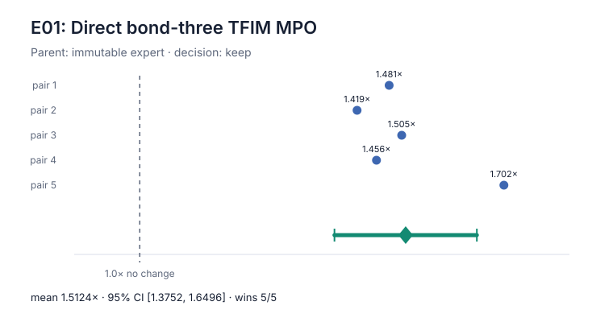

### e02: whole-training scan on the MPO graph

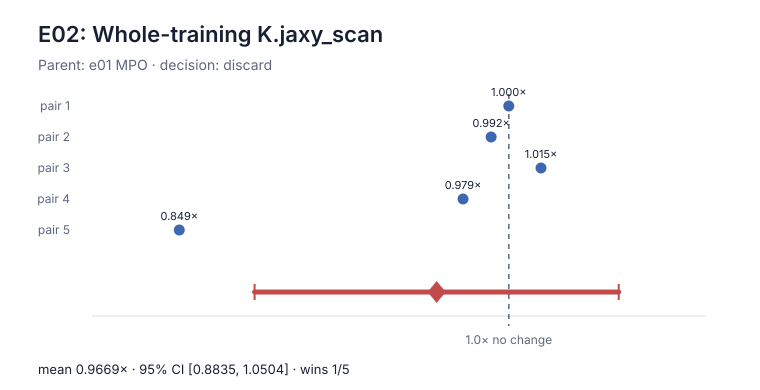

The scan tail was slower than 45 seconds. Removing Python dispatch did not
offset the larger compiled loop representation.

### e03: exact layer-local fusion

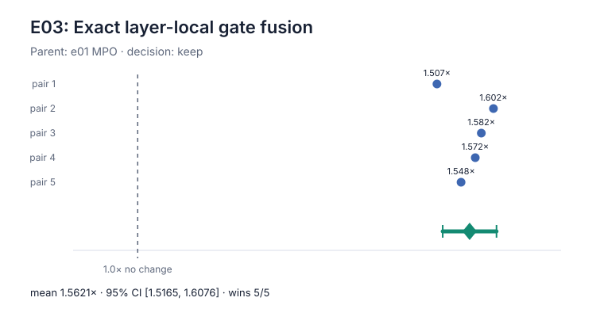

### e04: OMECo 1x1

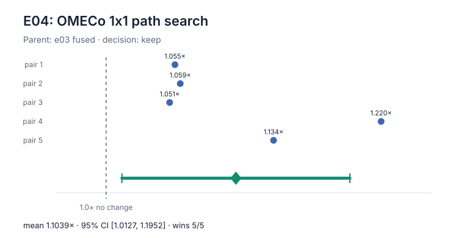

### e05: OMECo 4x4

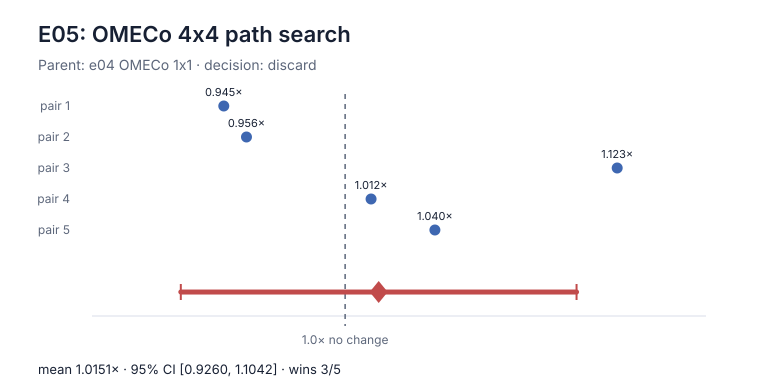

More search did not reliably improve the repeated contraction enough to repay
its end-to-end cost.

### e06: greedy contractor screen

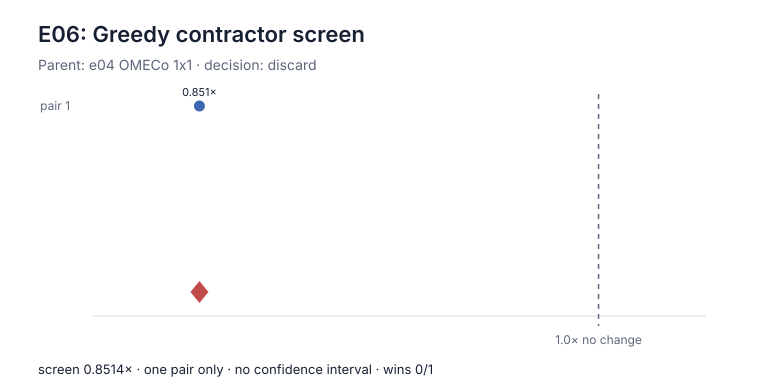

This was 17.45% slower in the predeclared quick screen, so no five-pair claim
was attempted.

### e07: batched closed-form gates

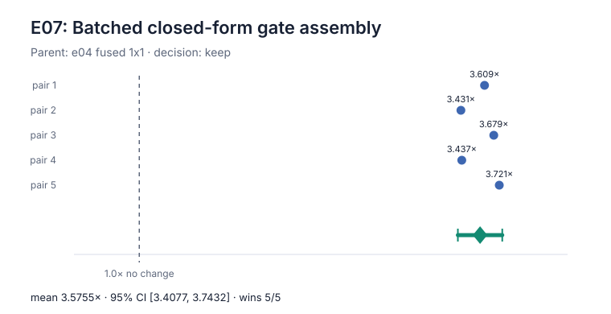

This is the dominant contribution.

### e08: within-layer pair-product batching

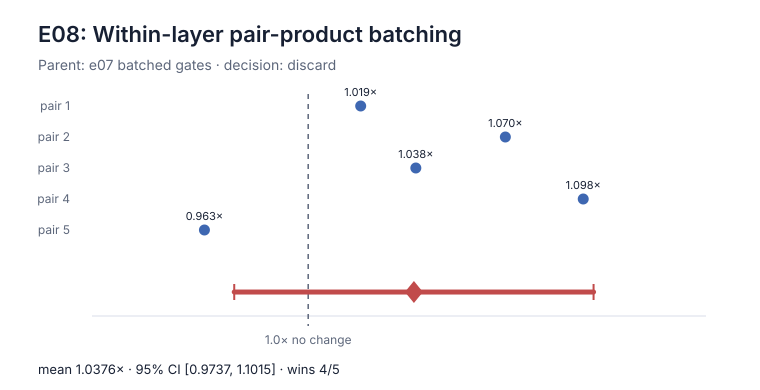

The isolated form did not establish a gain. It is not credited separately;
the later e10 result measures the coherent cross-layer restructuring.

### e09: scan retest after graph compression

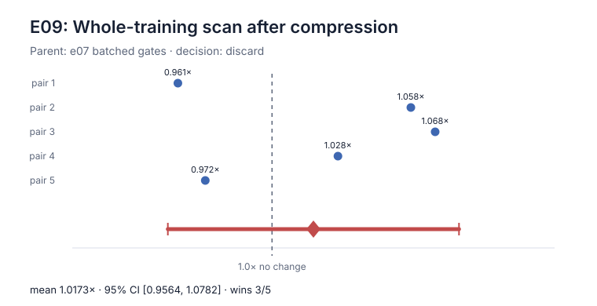

The result confirms that scan remains a noise-level factor even after each
update becomes much cheaper.

### e10: cross-layer global batching

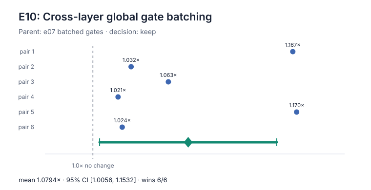

### e11: algebraic contraction primitives

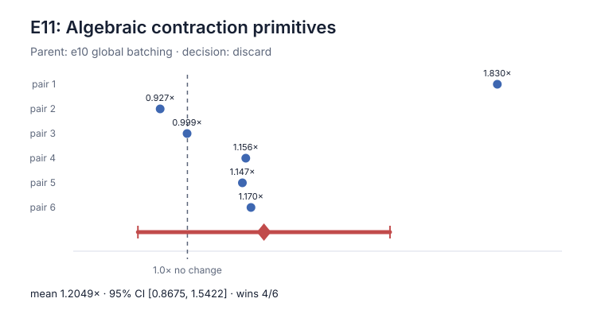

The parent had one 8.638-second outlier. Pooled means therefore look favorable,
but two pairs lost and the uncertainty interval spans both regression and
improvement. The factor is excluded.

## Exact-MPS negative result

The four-layer circuit admits an exact local-MPS representation: the input
bond dimension is at most eight and every bond is crossed twice by a rank-four
two-site gate, giving a worst exact bond dimension of 128. A no-truncation
TensorCircuit-backend implementation produced the correct initial energy and
the predicted bond dimensions.

However, its expanded reverse-mode gradient/update did not compile inside a
280-second hard screen. It is therefore a useful algebraic insight but a poor
end-to-end implementation for this fixed workload. No runtime speedup is
claimed and no chart is fabricated for a candidate without a valid timed
cell.

## Profile explanation

The same harness separates lowering, XLA compilation, steady update execution,
and generated graph size.

| Stage | Human expert | Campaign best | Reduction |
| --- | ---: | ---: | ---: |
| Lowering | 6.7701 s | 0.5416 s | 12.50x |
| XLA compilation | 22.6276 s | 2.1644 s | 10.45x |
| StableHLO lines | 86,824 | 2,754 | 31.53x |
| Steady update mean | 43.598 ms | 5.708 ms | 7.64x |
| Projected 500 updates | 21.799 s | 2.854 s | 7.64x |
| Estimated FLOPs/update | 875,047,872 | 132,386,304 | 6.61x |
| Estimated bytes/update | 624,489,344 | 49,688,780 | 12.57x |

The speedup is not one trick hidden among many edits. The MPO and fusion
reduce contraction work and node count; batched gate assembly removes the
largest repeated tracing graph; the smaller path budget and global batching
then contribute measured secondary gains. The rejected scan, larger search,
greedy, isolated pair batching, and primitive path remain visible rather than
being credited to the final speedup.

## Reproduction

From the repository root, using the measured image:

```bash
./bench run 01 --solution reference --repeat 6 --engine docker \
  --cpus 6 --memory 7g --timeout 300 --no-build \
  --output results/task-01-reference-reproduction

./bench run 01 --solution optimized --compare-to reference --repeat 6 \
  --engine docker --cpus 6 --memory 7g --timeout 300 --no-build \
  --output results/task-01-final-reproduction

python3 research/task-01/build_ablation_figures.py
python3 research/check_gates.py --task 01 \
  --baseline-report results/task-01-reference-20260729/results.json --json
```

Absolute seconds are not extrapolated across hardware. The claim is the
same-machine alternating-pair speedup under the frozen 6-CPU, 7-GiB,
network-disabled container.

## Limits

- The result covers the fixed public 32-qubit, four-layer, 500-step
  configuration.
- It makes no scaling or cross-hardware claim.
- Complex64 algebraic reassociation produces tiny numerical differences, so
  equality is reported with measured tolerances rather than as bit identity.
- No hidden data, evaluator loophole, skipped optimizer work, changed ansatz,
  or alternate quantum framework is used.
- The candidate keeps Python dispatch for the 500 compiled steps because both
  scan ablations failed to establish a gain.
