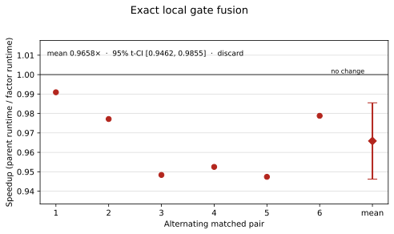
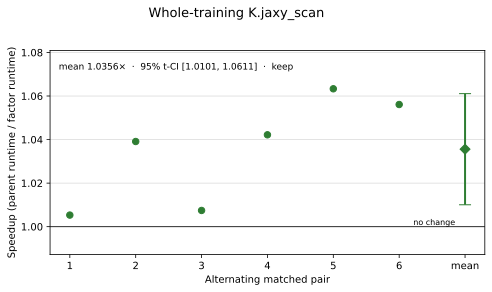
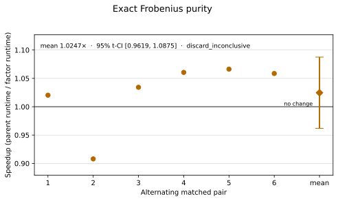
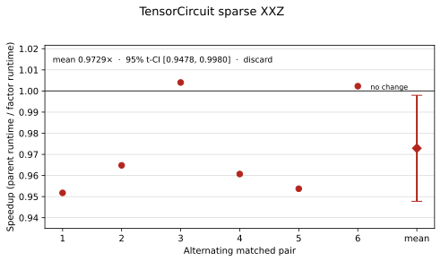
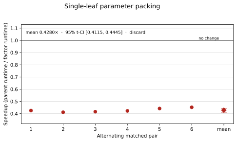
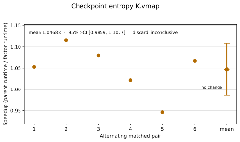
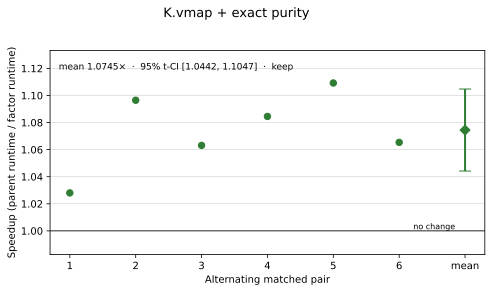

# Task 02 Human-Expert Optimization and Factor Ablation

## Result

The optimized implementation preserves the expert's 12-qubit
entanglement-profile-constrained VQE and is **1.11565x faster** in the final
six-pair same-machine comparison. Mean end-to-end runtime fell from
`4.495463 s` to `4.031039 s`; the candidate won all six counterbalanced
pairs. The mean paired speedup has a two-sided 95% Student-t interval of
`[1.057686x, 1.173613x]`.

| Pair | Order | Expert (s) | Candidate (s) | Speedup |
|---:|---|---:|---:|---:|
| 1 | expert → candidate | 4.865151 | 3.981228 | 1.222023x |
| 2 | candidate → expert | 4.364947 | 4.042312 | 1.079814x |
| 3 | expert → candidate | 4.411195 | 4.134876 | 1.066826x |
| 4 | candidate → expert | 4.457106 | 4.007787 | 1.112111x |
| 5 | expert → candidate | 4.432053 | 4.030015 | 1.099761x |
| 6 | candidate → expert | 4.442327 | 3.990016 | 1.113361x |
| **Mean** | — | **4.495463** | **4.031039** | **1.115649x** |

The requested first-five view is consistent: expert/candidate means are
`4.506090/4.039244 s`, and mean paired speedup is `1.116107x`. The sixth pair
is retained because the repository workflow predeclares six pairs and uses
their t-interval for promotion.

Machine-readable result:
[`profiles/final-reference-paired.json`](profiles/final-reference-paired.json).

## Optimized implementation

Two accepted mechanisms are present.

1. **One TensorCircuit training scan.** Parameters and Optax state are carried
   through one `K.jaxy_scan`, and the complete 500-update function is compiled
   once with `K.jit`. Each scan output is still the loss, energy density,
   three entropies, and entropy MSE evaluated *before* its corresponding Adam
   update. This removes 500 Python-to-device dispatches without removing an
   update or changing history semantics.
2. **One batched exact-purity kernel.** The three block checkpoint states are
   returned together. TensorCircuit's reduced density matrix is evaluated
   through `K.vmap`, and order-2 Renyi entropy uses the Hermitian identity
   `Tr(rho²) = sum(rho * conj(rho))`. This removes the three dense
   `rho @ rho` products while keeping TensorCircuit's normalized density
   matrices.

Both nested scans use TensorCircuit backend `K.jaxy_scan`; the final source
does not directly import JAX. NumPy is used only for deterministic
initialization/input conversion and Optax supplies the unchanged Adam update.
The circuit, state evolution, density matrices, Hamiltonian action, autodiff,
JIT, vmap, and scans remain TensorCircuit-NG/backend-native.

No parameter is tied or removed. There is no static answer, alternate quantum
framework, handwritten state-vector simulator, approximation, early stopping,
or relaxed evaluator threshold.

## Why these changes target the measured cost

The frozen reference profile found that one update lowers in `0.803158 s`,
compiles in `1.929769 s`, contains 15,479 StableHLO lines, and then takes
`0.002643 s` on average over 12 steady calls. Five hundred steady calls
project to `1.321653 s`, so both compilation and repeated dispatch/execution
are material.

The forward trajectory accounts for about 93.5% of separately measured loss
time (`0.000889/0.000951 s`). A single generic entropy call is only
`0.000132 s`, and a Hamiltonian action is `0.000176 s`. These measurements
explain why removing the host training loop helps, why entropy changes need
batching to become reliable, and why replacing the Hamiltonian action does
not help at this scale.

Reference profile:
[`profiles/reference-profile.json`](profiles/reference-profile.json).

## Factor ablation

Each timing-eligible factor was tested in six alternating matched pairs.
E01 and E02 compare with the immutable expert; E03–E07 compare directly with
the accepted scan parent. Ratios are therefore attribution experiments, not
numbers to multiply. A factor was promoted only when all cells passed, it won
at least five pairs, and the lower endpoint of its 95% paired-speedup
t-interval exceeded one.

| ID | Factor | Mean paired speedup | 95% t-CI | Wins | Decision |
|---|---|---:|---:|---:|---|
| E01 | Exact local gate fusion | 0.965849x | [0.946219, 0.985478] | 0/6 | Discard |
| E02 | Whole-training `K.jaxy_scan` | 1.035580x | [1.010063, 1.061098] | 6/6 | **Keep** |
| E03 | Frobenius purity alone | 1.024675x | [0.961881, 1.087470] | 5/6 | Inconclusive |
| E04 | TensorCircuit sparse XXZ | 0.972882x | [0.947782, 0.997981] | 2/6 | Discard |
| E05 | Single-leaf parameter packing | 0.428014x | [0.411501, 0.444527] | 0/6 | Discard |
| E06 | Checkpoint entropy `K.vmap` alone | 1.046783x | [0.985861, 1.107705] | 5/6 | Inconclusive |
| E07 | `K.vmap` + exact Frobenius purity | 1.074457x | [1.044174, 1.104740] | 6/6 | **Keep** |

### E01: exact local gate fusion

Fusion reduced 243 gate applications to 105, but dynamic trigonometry and
matrix construction outweighed the savings. The implementation was correct
at the gate, state, gradient, and post-update-observable levels, yet was
3.4% slower by paired ratio.



### E02: whole-training scan

All four 12-step histories were bit-identical. Moving the 500 updates across
one TensorCircuit scan boundary produced the first statistically supported
gain.



### E03: exact Frobenius purity alone

Replacing `trace(rho @ rho)` was numerically valid and won five pairs, but one
unfavorable pair widened the interval across one. It is not credited as an
independent gain.



### E04: TensorCircuit sparse XXZ

`PauliStringSum2COO(..., numpy=True)` and `K.sparse_dense_matmul` passed the
Hamiltonian and trajectory audits, but were slower than the current 45-term
MVP for this 4,096-amplitude state.



### E05: packed parameters

Packing ten PyTree leaves into `(3, 81)` was bit-exact but more than doubled
runtime. Static unpack slices introduce expensive gather/scatter work in
compilation and reverse mode; the expert's PyTree is already efficient.



### E06: checkpoint `K.vmap` alone

Batching the unchanged generic entropy kernel won five pairs but did not pass
the confidence rule. It is retained only as the predeclared subfactor evidence
for E07.



### E07: batched exact purity

Combining E03 and E06 changes the shared batched kernel: the three generic
density matrices remain TensorCircuit-generated while all three second
matrix products disappear together. This combination passed with `6/6` wins
and a lower confidence bound of `1.044174x`. The defensible attribution is to
the **combination**, not to either statistically inconclusive subfactor.



E08 attempted to batch pure-state Gram matrices directly for the contiguous
six/six cut. It was rejected before timing because the changed complex64
contraction order caused a `5.35e-6` entropy-history difference above the
frozen tolerance. Since it was not timing-eligible, no performance chart or
speedup claim is manufactured for it.

All plots are regenerated from the tracked paired JSON files by
[`plot_factor_ablations.py`](plot_factor_ablations.py).

## Correctness

The candidate preserves:

- the 12-qubit Neel state and complex64 TensorCircuit evolution;
- three even-plus-odd blocks and all 243 independently initialized angles;
- every ordered `RY`, `RZ`, `RXX`, `RYY`, and `RZZ` gate;
- the three normalized half-chain order-2 Renyi checkpoints;
- the exact 45-term open XXZ plus staggered-field energy;
- seed 2026, Adam learning rate `0.015`, exactly 500 sequential updates, and
  every pre-update history;
- the original four-key NumPy result contract.

After the final TensorCircuit-native normalization, the 12-step audit measured:

```text
initial loss absolute error:       0
maximum auxiliary error:           2.98e-7
maximum gradient-element error:    1.21e-8
maximum 12-step history error:     1.07e-6
```

Every one of the 12 final benchmark cells passed the canonical evaluator.
The candidate remains below the repository's 200-effective-line policy at
168 physical lines.

## Reproduction and provenance

The benchmark used a fresh evaluator process per cell in a no-network
container with six CPUs, 7 GiB memory, and a 300-second cap. The hard six-CPU
backend limit is not treated as a problem: every claim is a counterbalanced
relative comparison on the same machine and resource allocation.

Environment:

```text
image ID: sha256:b059c5fa7f75702f9afbf94ec7866e102ac32afd59d25634ec0aca0fd56e2833
TensorCircuit-NG: 1.8.0.dev20260726
JAX / JAXLIB: 0.10.0 / 0.10.0
Optax: 0.2.8
TensorNetwork / Quimb: 0.5.1 / 1.11.1
candidate SHA-256: aef3652f8d80ec6f3e414f9496295b8b852db2b256ec414f4146b3a636485b30
raw final report SHA-256: 27ec959f8e23156a0c8f0b15bb0f122b86e3a32e1842764888ef90eb07a842dd
```

Run:

```bash
./bench run 02 \
  --solution optimized --compare-to reference \
  --repeat 6 --engine docker --cpus 6 --memory 7g \
  --timeout 300 --no-build \
  --output results/task-02-final-20260729
```

Regenerate charts:

```bash
MPLCONFIGDIR=/tmp/task02-mplconfig \
  python3 research/task-02/plot_factor_ablations.py
```

The complete append-only chronology, candidate hashes, audits, raw-report
hashes, and negative results are in [`LOG.md`](LOG.md). The concise mechanism
ledger is in [`INSIGHTS.md`](INSIGHTS.md). The reusable campaign procedure is
[`EXPERT_OPTIMIZATION_WORKFLOW.md`](../../autoresearch/EXPERT_OPTIMIZATION_WORKFLOW.md).

The conclusion is intentionally limited to this public canonical workload,
latest tested TensorCircuit-NG image, and same-host resource allocation. It is
not a global SOTA or scaling claim.
