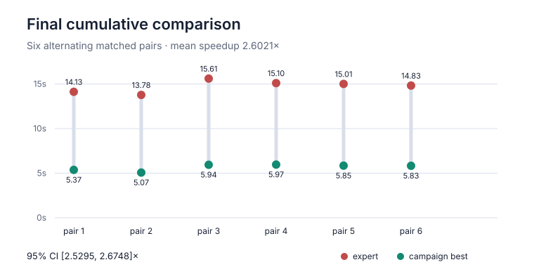
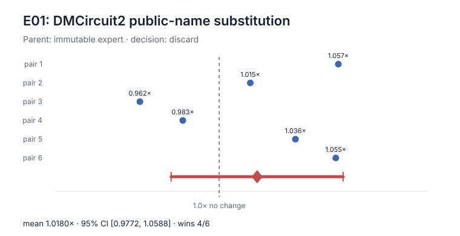
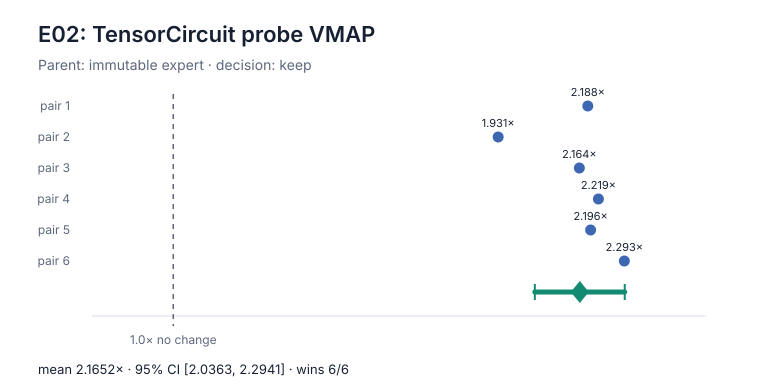
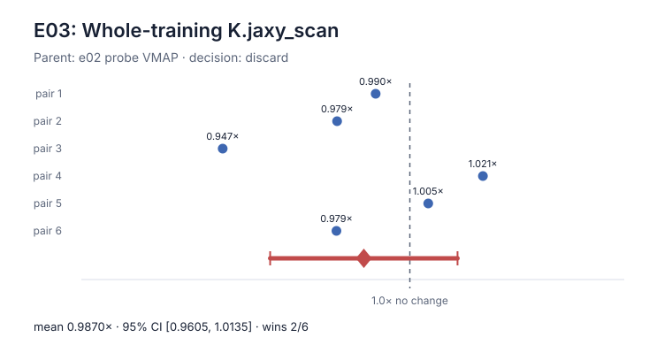
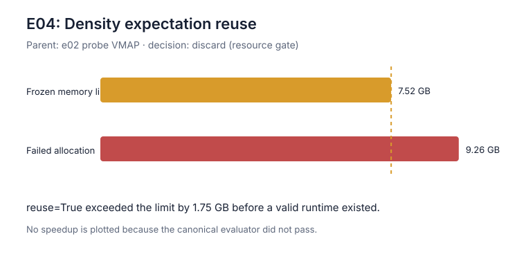
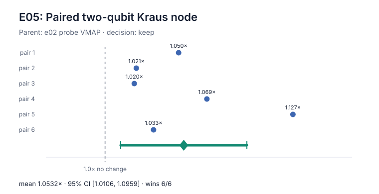
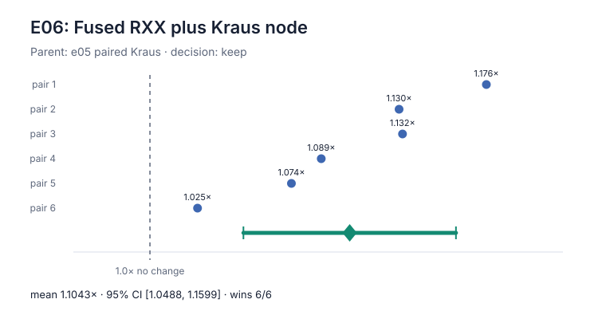
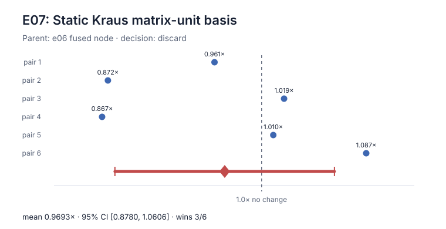

# Task 04 TensorCircuit-Native Optimization Report

## Scope and claim

This campaign optimizes only ORBIT-Q Task 04, trainable asymmetric Kraus-noise
calibration. It compares the immutable bundled human expert with a
TensorCircuit-NG-native implementation under the same evaluator, container,
6-CPU allocation, and 7 GiB memory limit.

No external result publishes an evaluator-compatible runtime for this exact
workload and environment. The result is therefore the **Task 04 campaign
best**, not a claim of global state of the art.

| Role | Artifact | SHA-256 |
| --- | --- | --- |
| Immutable expert | [`references/task-04/solution_4.py`](../../references/task-04/solution_4.py) | `04e37b73e7246599ed3eb8f65e38bb7e084db7aab511d7af3b20baa0867b21ae` |
| Campaign best | [`src/solutions/task-04/solution_4.py`](../../src/solutions/task-04/solution_4.py) | `251f283d208ebb5316c8347ff71ea6da66aca5fd11b42f25032db32ada83ef0c` |
| Sanitized measurements | [`results-20260729/ablation-summary.json`](results-20260729/ablation-summary.json) | Generated only from immutable benchmark reports |
| Complete evidence ledger | [`LOG.md`](LOG.md) | Append-only experiment history |
| Reusable workflow | [`autoresearch/EXPERT_OPTIMIZATION_WORKFLOW.md`](../../autoresearch/EXPERT_OPTIMIZATION_WORKFLOW.md) | Branch, gate, profile, ablation, and promotion procedure |

## Final result

Every evaluator cell passed. The candidate won all six matched alternating
pairs.

| Metric | Human expert | Campaign best |
| --- | ---: | ---: |
| Passing runs | 6/6 | 6/6 |
| Mean runtime | 14.742286 s | 5.672258 s |
| Median runtime | 14.918234 s | 5.838748 s |
| Runtime standard error | 0.274987 s | 0.148840 s |
| Runtime range | 13.777276–15.608513 s | 5.073188–5.966287 s |
| Mean paired speedup | — | **2.602133x** |
| Paired-speedup standard error | — | 0.028270x |
| 95% Student-t interval | — | **2.529463x–2.674804x** |
| Ratio-of-means runtime reduction | — | **61.52%** |

The user's five-run view is consistent with the authoritative six-pair result:
the first five pairs average 14.725538 s for the expert, 5.640346 s for the
candidate, and 2.614107x paired speedup.



### Matched timings

| Pair | Order | Expert | Campaign best | Speedup |
| ---: | --- | ---: | ---: | ---: |
| 1 | expert → candidate | 14.127885 s | 5.372511 s | 2.629661x |
| 2 | candidate → expert | 13.777276 s | 5.073188 s | 2.715704x |
| 3 | expert → candidate | 15.608513 s | 5.944067 s | 2.625898x |
| 4 | candidate → expert | 15.103575 s | 5.966287 s | 2.531487x |
| 5 | expert → candidate | 15.010442 s | 5.845679 s | 2.567784x |
| 6 | candidate → expert | 14.826026 s | 5.831817 s | 2.542265x |

The raw final report SHA-256 is
`c234d9fd4de4ab992f97b524e99e2894732e0ca608d69bc43f1459f5d500c84d`.
It is summarized without host paths or machine identity in the tracked JSON.

## Retained implementation

The final source keeps the original imports—NumPy, Optax, and
TensorCircuit-NG—and adds no direct JAX or alternate quantum-framework import.
The quantum computation remains a TensorCircuit density-matrix tensor network.

### 1. Batch the four exact probe tensor networks

The expert traces four separately constructed noisy circuits into the gradient
graph. The optimized implementation builds the same GHZ, Bell-pair, zero, and
plus states once with `tc.Circuit`, stacks their state tensors, and evaluates
one shared noisy-circuit function through TensorCircuit `K.vmap`.

This is the dominant factor. It reduces the per-update StableHLO from 21,720
to 4,855 lines and changes the end-to-end mean from 15.029802 s to 6.962292 s
in its isolated six-pair experiment.

### 2. Replace two adjacent channel nodes with one exact product channel

Let the original single-qubit asymmetric channel have Kraus matrices
\(\{K_0,K_1,K_2\}\). Applying it independently to both qubits after an
entangler is exactly the two-qubit channel with nine Kraus matrices

\[
M_{ab}=K_a\otimes K_b,\qquad a,b\in\{0,1,2\}.
\]

The candidate constructs these matrices with TensorCircuit backend `K.kron`
and supplies them to `DMCircuit.apply_general_kraus`. This changes 22
single-qubit channel nodes per probe into 11 two-qubit channel nodes without
changing the map. Its isolated contribution is 1.053233x, with 95% interval
1.010551x–1.095914x and 6/6 wins.

### 3. Absorb each fixed RXX into its following Kraus node

For the fixed entangler unitary \(U_{\mathrm{RXX}}\), the required operation is

\[
\rho\longmapsto
\sum_{a,b}(K_a\otimes K_b)U_{\mathrm{RXX}}\rho
U_{\mathrm{RXX}}^\dagger(K_a\otimes K_b)^\dagger.
\]

Therefore the exact fused Kraus matrices are

\[
L_{ab}=(K_a\otimes K_b)U_{\mathrm{RXX}}.
\]

The final implementation builds `U_RXX` through
`tc.gates.rxx_gate`, reshapes it with `K.reshape`, multiplies it into the nine
product matrices, and applies the result through TensorCircuit
`apply_general_kraus`. All 11 explicit RXX nodes disappear. This factor alone
adds 1.104347x, with 95% interval 1.048841x–1.159853x and 6/6 wins.

## Preserved scientific computation

The expert and campaign-best implementations both:

- generate the target observable table inside timed `run_solution`;
- prepare all four required 12-qubit probes with TensorCircuit;
- preserve the six even and five odd RXX bond order and angle;
- apply the exact user-defined asymmetric channel independently to both
  participating qubits after every entangler;
- return every single-site Z expectation and full-chain Z parity;
- use the same sigmoid parameterization and initial probabilities;
- perform exactly 120 dependent Adam updates at learning rate `0.04`;
- retain the reference's pre-update loss history and final reported auxiliary
  observables;
- use complex64 TensorCircuit/JAX-backend semantics; and
- return the unchanged NumPy result schema.

The optimization changes tensor-network representation and tracing structure,
not the physical map, optimizer, data, tolerance, or amount of required work.

Reduced exact-equivalence checks compare the target, loss, observables,
gradient, one Adam update, complete three-step loss history, final
probabilities, and fitted expectations. For the final candidate the largest
absolute error is `2.38e-7`, below the frozen `2e-6` threshold. The full
12-qubit canonical evaluator also passes.

## Factor-by-factor ablation

Each performance factor was declared before timing and tested against its
accepted parent. A factor was retained only when all cells passed, candidate
mean and median were lower, at least five of six pairs won, and the 95%
paired-speedup confidence interval was entirely above 1.

| ID | Single factor | Parent | Result | Decision |
| --- | --- | --- | --- | --- |
| e01 | Rename `DMCircuit` to `DMCircuit2` | Expert | 1.018020x; CI crosses 1; 4/6 wins | Discard |
| e02 | Probe `K.vmap` | Expert | 2.165207x; CI 2.036340x–2.294073x; 6/6 | **Keep** |
| e03 | Whole-training `K.jaxy_scan` | e02 | 0.986981x; 2/6 wins | Discard |
| e04 | `expectation(..., reuse=True)` | e02 | 9.26 GB allocation exceeds 7 GiB | Discard |
| e05 | Pair adjacent Kraus nodes | e02 | 1.053233x; CI 1.010551x–1.095914x; 6/6 | **Keep** |
| e06 | Fuse RXX into paired Kraus node | e05 | 1.104347x; CI 1.048841x–1.159853x; 6/6 | **Keep** |
| e07 | Static Kraus matrix-unit basis | e06 | 0.969277x; 3/6 wins | Discard |

### e01: public-name substitution



Runtime introspection found that in the measured
TensorCircuit-NG `1.8.0.dev20260726` image both `tc.DMCircuit` and
`tc.DMCircuit2` resolve to
`tensorcircuit.densitymatrix.DMCircuit2`. The source rename is a real no-op;
its small apparent change is timing noise. This corrects the initial
legacy-class hypothesis in the frozen survey.

### e02: probe VMAP



This is the main contribution and the only retained factor benchmarked
directly against the immutable expert.

### e03: whole-training scan



The reference profile projected only 0.151 s for 120 already-compiled update
executions. Task 04 is compilation-dominated, so removing Python dispatch did
not help; the scan wrapper regressed slightly.

### e04: density expectation reuse



`reuse=True` is exact on the reduced case, but the canonical differentiated
batch requests a 9,263,654,532-byte allocation and fails under the frozen
7 GiB limit. No runtime or speedup is claimed for a failed evaluator cell.

### e05: paired Kraus node



This factor halves channel-superoperator node count while retaining the exact
independent product channel.

### e06: fused RXX and Kraus node



This factor removes every explicit entangler node and is the strongest
secondary contribution.

### e07: static Kraus basis



Although the source is shorter, the generated execution is slower and more
variable. It is excluded from the final implementation.

## Profile explanation

The same profiling harness separates target construction, lowering, XLA
compilation, steady update execution, and StableHLO size.

| Stage | Expert | e02 VMAP | e05 paired Kraus | e06 fused final |
| --- | ---: | ---: | ---: | ---: |
| Target table | 2.629 s | 2.323 s | 1.790 s | 1.706 s |
| Lowering | 3.068 s | 0.616 s | 0.547 s | 0.396 s |
| XLA compilation | 10.712 s | 2.014 s | 2.138 s | 1.639 s |
| StableHLO lines | 21,720 | 4,855 | 4,602 | 3,283 |
| Steady update mean | 1.257 ms | 8.035 ms | 11.144 ms | 10.204 ms |

The optimized steady kernel is not faster. The end-to-end win comes from
tracing and compiling a much smaller TensorCircuit graph. This distinction is
why scan and cosmetic scalar-assembly changes were rejected while probe
batching and exact local-node fusion were retained.

## Reproduction

From the repository root, using the existing measured image:

```bash
./bench run 04 --solution reference --repeat 6 --engine docker \
  --cpus 6 --memory 7g --timeout 300 --no-build \
  --output results/task-04-reference-reproduction

./bench run 04 --solution optimized --compare-to reference --repeat 6 \
  --engine docker --cpus 6 --memory 7g --timeout 300 --no-build \
  --output results/task-04-final-reproduction

python3 research/task-04/build_ablation_figures.py
python3 research/check_gates.py --task 04 \
  --baseline-report results/task-04-reference-20260729-v2/results.json \
  --json
```

Timed comparisons are meaningful only within one host session. Absolute
runtime is not extrapolated across hardware.

## Limits

- The claim covers the fixed public 12-qubit Task 04 configuration only.
- No scaling or cross-hardware claim is made.
- No hidden or private evaluation data was used.
- OMECo was not selected: runtime inspection showed the image already uses a
  preprocessed greedy TensorCircuit contractor, and the measured bottleneck
  was graph duplication rather than path-search quality.
- TensorCircuit has no multi-observable density-matrix API that shares scalar
  contractions without full-state reuse; the available reuse path fails the
  frozen memory gate.
