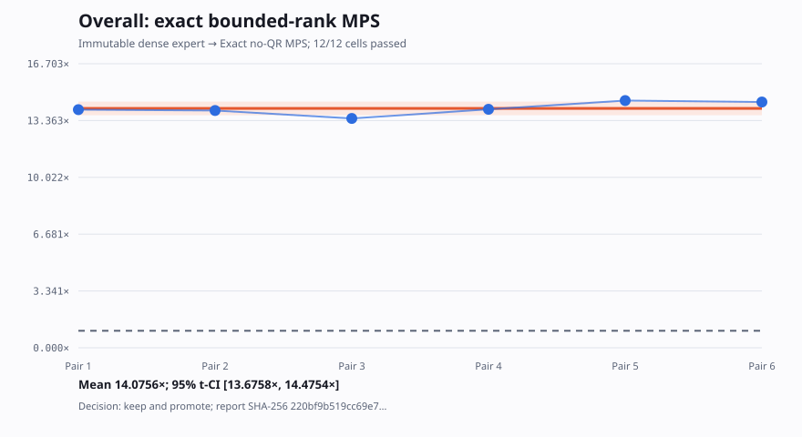
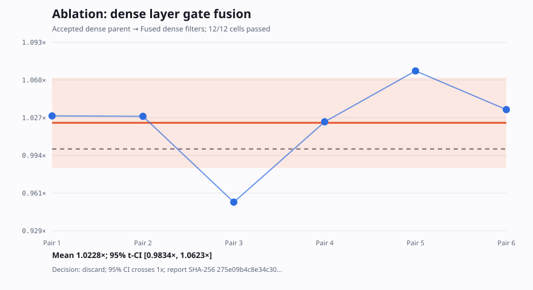
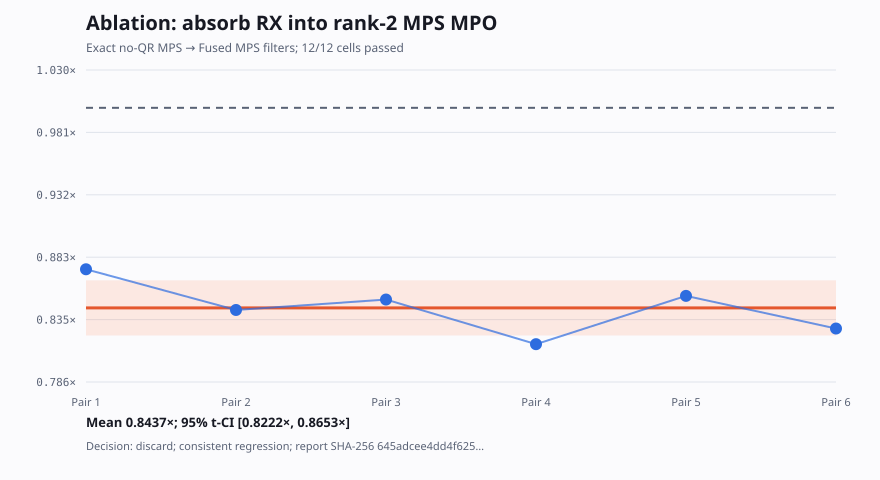

# Task 05 exact-MPS optimization report

## Outcome

The continued Task 05 campaign replaces the dense `2^18` cooling trajectory
with an exact, untruncated TensorCircuit-NG MPS whose maximum bond dimension
is 32. It retains ten non-unitary layers, normalization after every layer,
gradient flow through every normalization, and all 600 Adam updates.

On the latest local TensorCircuit-NG image, fixed to 6 CPUs and 7 GiB, all 12
cells in six alternating matched pairs passed:

| Metric | Immutable expert | Exact MPS |
|---|---:|---:|
| Passing runs | 6/6 | 6/6 |
| Mean runtime | 97.083712 s | 6.898409 s |
| Median runtime | 99.526263 s | 6.977020 s |
| Runtime standard error | 2.183903 s | 0.146705 s |
| Mean paired speedup | — | **14.075570x** |
| 95% Student-t interval | — | **13.675752x–14.475387x** |
| Mean paired reduction | — | **92.891125%** |

The candidate won all six pairs. The first five pairs, for compatibility with
the requested five-run average, give 96.355727 s expert versus 6.884156 s MPS
and a 14.000343x mean paired speedup. The six-pair result is authoritative.



The immutable sanitized evidence is
[`results-20260729/ablation-summary.json`](results-20260729/ablation-summary.json),
generated from raw report SHA-256
`220bf9b519cc69e7996a78855308fa1e1b70b82a51d7861561cca8b5a01678c5`.
The optimized source SHA-256 is
`f741e6cc75b8ed1e47bbedafc557d231d54db60fb064011650fc9c7da36c9ef6`.

This is a same-workload, same-host expert optimization result. No global SOTA
claim is made because no external implementation was measured in the same
environment.

## Why an exact MPS exists

The human expert evolves a dense complex64 vector. Task 05's circuit has a
stronger exact structure:

- `exp(a X)` is a one-site operator and cannot increase MPS bond dimension.
- Each two-site filter has operator-Schmidt rank two:

  `exp(b Z.Z) = cosh(b) I.I + sinh(b) Z.Z`.

- A bond is used only by its parity's five brickwork layers.

Therefore every state bond has the exact upper bound

`1 -> 2 -> 4 -> 8 -> 16 -> 32`.

There is no singular-value cutoff, tolerance, compression, or approximate
truncation. The candidate computes the same full state in a different exact
representation.

## Implementation

### TensorCircuit-owned MPS state

The `|+>^18` product tensors initialize `tc.MPSCircuit`. RX filters use
`tc.gates.rx`; conversion, contraction, differentiation, JIT, and scan use
TensorCircuit's active backend `K`.

### No-QR rank-two MPO update

The historical generic `MPSCircuit.apply_MPO` experiment timed out because it
canonicalized each exact update with QR/RQ. The rank bound is already known,
so canonicalization is unnecessary. The promoted implementation uses the
local contraction kernel from that TensorCircuit method:

```python
contracted = K.einsum("iabj,kbl->ikajl", operator, tensor)
result = K.reshape(contracted, (ni * nk, d, nj * nl))
```

The two local MPO tensors encode the `I.I` and `Z.Z` branches exactly. This is
the decisive difference from the timed-out historical MPS round.

### Every normalization is retained

After each of the ten layers, a left-to-right TensorCircuit backend
double-layer contraction computes the exact MPS norm. Dividing the first MPS
tensor by that norm rescales the entire represented state and keeps the
normalization inside the differentiable graph.

### Direct TFIM MPO and whole-training scan

The open-boundary TFIM is a deterministic bond-3 MPO. Its expectation is
contracted left-to-right against the final MPS. The complete 600-step Adam
loop uses `K.jaxy_scan`, so the final source imports no raw JAX module and
does not dispatch 600 training steps from Python.

The final implementation has 144 effective non-comment Python lines, below
the 200-line policy limit.

## Correctness evidence

[`check_exact_mps_equivalence.py`](check_exact_mps_equivalence.py) compares
the candidate with the immutable dense expert at the public initial
parameters. Its sanitized outputs are retained in
[`results-20260729/equivalence-summary.json`](results-20260729/equivalence-summary.json):

| Check | Maximum error or value |
|---|---:|
| Reconstructed 18-qubit state | `2.79397e-08` |
| State norm | `4.17233e-07` |
| Initial energy density | `1.79052e-04` |
| Gradient | `1.19507e-05` |
| One Adam update, non-degenerate components | `3.72529e-09` |
| Maximum exact MPS bond dimension | `32` |

The state comparison is stricter than the observable comparison. The slightly
larger complex64 energy difference comes from evaluating the same state with
a bond-3 MPO reduction order instead of the dense Pauli-sum order.

One expert gradient component, the first uniform RX strength on `|+>^18`, is
analytically zero because that RX filter contributes only a scalar removed by
the first normalization. Adam's first-step normalization amplifies tiny
complex64 noise at this degenerate component, so the harness reports both the
raw difference and a conditioned comparison over nonzero-gradient
components. All physical state, energy, gradient, and full-evaluator checks
remain explicit.

The six candidate evaluator runs were deterministic:

- initial energy density: `-1.1718612909`;
- final energy density: `-1.3267861605`;
- exact sparse ground energy density: approximately `-1.326898`;
- history length: 600;
- all shape, improvement, lower-bound, and upper-bound checks: PASS.

## Factor ablation

The continuation measured each new factor independently where a direct
same-container comparison was available.

| Factor | Reference mean | Candidate mean | Paired speedup | 95% t-CI | Decision |
|---|---:|---:|---:|---:|---|
| Exact no-QR MPS, overall vs immutable expert | 97.0837 s | 6.8984 s | 14.0756x | 13.6758x–14.4754x | Keep |
| Dense RX/RZZ layer fusion vs accepted dense parent | 68.3585 s | 66.9658 s | 1.0228x | 0.9834x–1.0623x | Discard; inconclusive |
| Absorb RX into MPS rank-2 MPO vs e02 MPS | 7.0089 s | 8.3105 s | 0.8437x | 0.8222x–0.8653x | Discard; regression |

### Dense layer fusion

Combining each disjoint `RX -> RX -> RZZ` sequence into one TensorCircuit
two-site gate is numerically valid, but its six-pair confidence interval
crosses 1. Fewer graph nodes did not reliably improve the Cotengra contraction
path.



### RX absorption into the MPS MPO

Algebraically absorbing RX into both RZZ MPO branches is also exact, but it
duplicates local matrix work across the two branches and regressed every
pair. The unfused e02 MPS remains the promoted source.



### Attribution limit

A final direct six-pair exact-MPS-versus-accepted-dense-parent run was
requested. Its Docker approval service disconnected before execution and
explicitly prohibited an automatic retry. No value is inferred for that
missing comparison.

The earlier campaign already isolated whole-training scan at 1.0980x on its
older pinned environment and measured the accepted scan-plus-reusable-greedy
candidate at 1.4615x versus the immutable expert. Those historical results are
useful context, not a substitute for a current direct MPS-versus-parent pair.
The safe conclusion is that the current complete candidate is 14.0756x faster
than the immutable expert, while the exact share attributable only to MPS
cannot be numerically separated in this session.

## Reproduction

The campaign used image
`orbitbreakers-expert-benchmarks:tensorcircuit-py311`, image ID
`sha256:b059c5fa7f75702f9afbf94ec7866e102ac32afd59d25634ec0aca0fd56e2833`,
with TensorCircuit-NG `1.8.0.dev20260726`. Host fingerprint:
`c627504db97dc65b8d998afb4b9cdf73cfc3eff2ce2ac589b4a7a4aa0c7fdc48`.

```bash
python3 research/task-05/check_exact_mps_equivalence.py

./bench run 05 \
  --solution optimized \
  --compare-to reference \
  --repeat 6 \
  --engine docker \
  --cpus 6 \
  --memory 7g \
  --timeout 300 \
  --no-build \
  --output results/task-05-final
```

The reusable end-to-end procedure is documented in
[`autoresearch/EXPERT_OPTIMIZATION_WORKFLOW.md`](../../autoresearch/EXPERT_OPTIMIZATION_WORKFLOW.md).

## Limits

- Evidence covers the one fixed public Task 05 workload and one host.
- Absolute runtimes are not compared with the earlier 8-CPU campaign.
- The exact MPS rank bound depends on the published ten-layer brickwork
  structure; larger-depth variants need a new scaling study.
- Complex64 contraction order changes tiny floating-point details while
  preserving exact algebra and all evaluator criteria.
- The missing direct MPS-versus-accepted-parent pair is disclosed rather than
  reconstructed from unmatched sessions.
