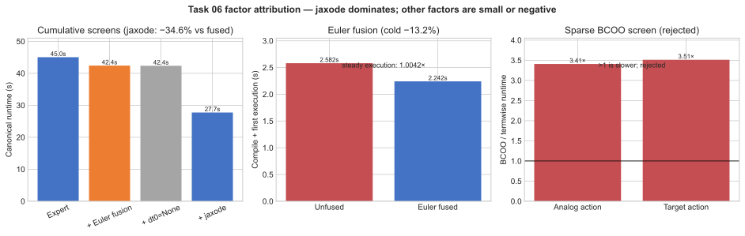

# Task 06 Human-Expert Optimization and Factor Ablation

## Result

The optimized solution preserves the expert's continuous-time TensorCircuit
calculation and is **1.504x faster** on the final five-pair same-machine
benchmark. Mean end-to-end runtime fell from `41.4259 s` to `27.5366 s`
(`33.53%`), and the candidate won all five counterbalanced pairs.

| Pair | Order | Expert (s) | Candidate (s) | Speedup |
|---:|---|---:|---:|---:|
| 1 | expert → candidate | 41.3896 | 27.2906 | 1.5166x |
| 2 | candidate → expert | 41.3893 | 27.6433 | 1.4973x |
| 3 | expert → candidate | 41.4415 | 27.6251 | 1.5001x |
| 4 | candidate → expert | 41.5825 | 27.3809 | 1.5187x |
| 5 | expert → candidate | 41.3267 | 27.7431 | 1.4896x |
| **Mean** | — | **41.4259** | **27.5366** | **1.5044x** |

The mean paired speedup is `1.50446x ± 0.00566` standard error, with a
two-sided 95% t-interval of `[1.48875x, 1.52018x]`.

## Optimized implementation

Two accepted changes are present:

1. Fuse each exact digital `RZ → RY → RZ` Euler sequence into one
   phase-corrected TensorCircuit `U` gate while retaining all 168 independent
   angles.
2. Select TensorCircuit's native `jaxode` backend for the same adaptive
   `tc.timeevol.ode_evol_global` calls, with the original vector field,
   endpoints, tolerances, and maximum-step bound.

No Trotter approximation, static answer, dense replacement simulator, or
parameter removal is used.

## Factor ablation

The campaign changed one factor at a time. Canonical single screens establish
the cumulative direction; isolated profilers explain which phase is affected.
Only the final promoted candidate received the five-pair inference above, so
the single-screen percentages below are diagnostic rather than independent
confidence intervals.

| Factor | Comparison | Evidence | Attribution |
|---|---|---|---|
| Exact Euler fusion | expert `45.0372 s` six-run historical mean → e01 `42.4126 s` single canonical screen | State, energy, and gradient equivalence passed. Isolated steady gradient speedup was only `1.0042x`, but compile-plus-first-execution fell from `2.5819 s` to `2.2421 s`. | Small compile-oriented contribution; the apparent 5.8% end-to-end delta is not claimed as a separately significant effect. |
| Diffrax automatic `dt0` | e01 `42.4126 s` → e02 `42.3620 s` | Only `0.12%`; displayed outputs unchanged. | Neutral; discarded. |
| TensorCircuit `jaxode` | e01 `42.4126 s` → e03 `27.7480 s` | Same canonical evaluator and fused circuit; `1.5285x` single-screen speedup. Energy, gradient, and one-update audit passed. | **Dominant positive factor.** |
| TensorCircuit BCOO Hamiltonians | termwise MVP versus BCOO microbench | BCOO was `3.4–3.5x` slower for both analog and target actions. | Negative; discarded before integration. |
| Whole-training scan | not integrated | ODE backend change already dominates; no unsupported percentage assigned. | Open follow-up, not part of the reported speedup. |

The defensible conclusion is therefore narrower than “all edits helped”:
**the ODE backend accounts for the large gain**. Euler fusion is a smaller
compile-cost optimization, automatic initial-step selection contributes
nothing measurable, and sparse BCOO conversion is actively harmful on this
stack.



The panels use the frozen canonical screens and isolated profiler values.
They are intentionally not multiplied together: the left panel is cumulative,
while the other two isolate compilation and Hamiltonian-action mechanisms.
Regenerate with
[`plot_factor_ablation.py`](plot_factor_ablation.py).

## Correctness

The candidate keeps the 14-qubit Néel state, four hybrid blocks, four true
adaptive ODE evolutions per loss, all analog variables, all digital angles,
seed 2026, complex64 TensorCircuit/JAX computation, target Hamiltonian,
exactly 100 Adam updates, and every pre-update energy.

For the `jaxode` substitution, the frozen audit measured:

```text
initial energy absolute error:     7.39e-6  <= 5e-5
maximum gradient element error:    3.38e-5  <= 5e-4
post-update parameter max error:   2.98e-8
post-update energy absolute error: 4.77e-7  <= 2e-3
```

All ten cells in the final paired benchmark passed the canonical evaluator.

## Reproduction and provenance

The final benchmark used one no-network container, a fresh evaluator process
per cell, counterbalanced order, six CPUs, 7 GiB memory, and a 300-second cell
cap. Image ID:
`sha256:b059c5fa7f75702f9afbf94ec7866e102ac32afd59d25634ec0aca0fd56e2833`.

Run:

```bash
python3 research/task-06/run_docker_matrix.py \
  --repeat 5 --max-steps 100 --timeout 300 \
  --cpus 6 --memory 7g \
  --output /private/tmp/task06-e03-five-pair
```

Machine-readable summary:
[`profiles/e03-final-five-pair.json`](profiles/e03-final-five-pair.json).
The full experimental chronology and rejected variants are in
[`LOG.md`](LOG.md).
