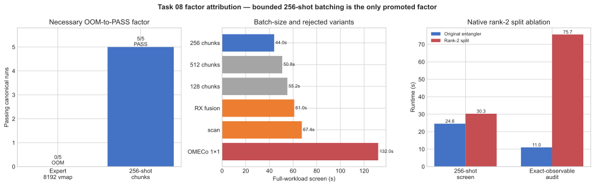

# Task 08 Sampling Campaign Report

## Outcome and claim

This campaign optimized only ORBIT-Q Task 08: exact conditional sampling from
a 49-qubit 7x7 mixed-axis TensorCircuit network.

The campaign-best solution changes one execution dimension: instead of mapping
`perfect_sampling` over all 8192 shots at once, it maps the same TensorCircuit
function over contiguous 256-shot blocks and concatenates the resulting NumPy
arrays. The fixed circuit, complete RNG status matrix, sample count, sample
order and evaluator are unchanged.

On the fixed six-CPU, 7-GiB Docker allocation:

- the immutable expert failed all five canonical 8192-shot attempts with XLA
  `RESOURCE_EXHAUSTED` or cgroup exit 137 and never produced an evaluator
  runtime;
- the candidate passed all five interleaved canonical attempts in
  47.356313 s mean, 45.220425 s median, and 2.626467 s standard error;
- therefore the primary established result is **OOM to reproducible PASS**,
  not a numerical speedup.

An independent 64-GiB x86_64 Slurm session then completed the requested five
canonical alternating-order pairs: all 10 cells passed, with expert
126.675308 s mean and candidate 123.187734 s mean. The 2.7532% descriptive
mean reduction is not a confirmed speedup: the candidate won only 3/5 pairs,
and mean pairwise speedup was 1.0452x with 95% Student-t interval
`[0.8176, 1.2729]`. This run definitively shows that the public expert is
algorithmically runnable when enough memory is available.

The evaluator-supported 2048-shot scale probe provides a runtime comparison:
all 12 cells passed, with reference 32.246056 s mean and candidate
29.838621 s mean (7.4658% lower; ratio of means 1.0807x). The candidate won
only four of six pairs, however, and the mean paired-speedup 95% Student-t
interval is 0.8881x–1.2904x. This misses the frozen promotion rule, so the
7.47% number is reported descriptively and is **not claimed as a confirmed
speedup**.

No matched external system reports this evaluator workload. The implementation
is called the campaign best, not global SOTA.

| Role | Artifact | SHA-256 |
| --- | --- | --- |
| Immutable expert | `references/task-08/solution_8.py` | `0b0df74257e8f55d717ca29bb36e2edbb803206e9b2966fa423fefca9f15c311` |
| Campaign best | `src/solutions/task-08/solution_8.py` | `7696f4d742d07da92a06cf5bdd4634f26ca5fe9251471163a90a4b6da280b45d` |
| Evaluator | `tasks/task-08/evaluator/evaluate_8.py` | `bffda6b012b07fd1cb8d5a1ec8a763bba4f1b967e5adc0d2b704e6ae99de9c41` |
| Docker image | `orbitbreakers-expert-benchmarks:tensorcircuit-py311` | `sha256:b059c5fa7f75702f9afbf94ec7866e102ac32afd59d25634ec0aca0fd56e2833` |
| High-memory Python SIF | Python 3.11.15, locked x86_64 dependencies | `17dcff888e341955e53682a44ebd8b6894ed38ecc6fc95e8ee5b9c20fd35989a` |

## Why the expert fails in 7 GiB

The expert creates the entire float32 status matrix with shape `(8192, 49)`
and calls:

```python
sample_batch = K.jit(K.vmap(sample_one))
samples = sample_batch(status)
```

`perfect_sampling` performs 49 sequential conditional double-layer tensor
network contractions. Mapping the whole function over 8192 trajectories makes
the shot axis part of every XLA intermediate. In the final five-pair session,
four failures reported attempted allocations between 9.31 GB and 17.97 GB;
the fifth process was killed with exit 137. The container limit is 7 GiB.

The candidate retains the same mapped function but calls its cached JIT on 32
contiguous 256-row slices:

```python
samples = [
    np.asarray(
        K.numpy(sample_batch(status[start : start + 256])),
        dtype=np.int32,
    )
    for start in range(0, config["n_samples"], 256)
]
```

The first block pays path-search, tracing and compilation cost. Later blocks
reuse the same compiled shape while keeping only one block's contraction
intermediates live. Host-side outputs are small
(`8192 * 49` integer entries), so concatenation is negligible relative to the
network contractions.

## Preserved scientific semantics

Both implementations:

- start from `|0>^49`;
- apply the same 49 position-dependent `Ry` gates, 42 horizontal `RZZ`
  gates, 42 vertical `RXX` gates and 49 final `Rx` gates in TensorCircuit;
- use complex64 and `tc.set_contractor("omeco-4-4")`;
- generate the entire float32 status matrix with NumPy `default_rng(2033)`;
- consume every status row exactly once in original order;
- call TensorCircuit `Circuit.perfect_sampling` for every shot;
- return exactly one integer NumPy array with shape `(n_samples, 49)`;
- materialize neither a dense `2^49` state nor a dense probability vector.

Changing the mapped batch shape can change complex64 contraction rounding and
flip a small number of status values that fall extremely close to conditional
probability thresholds. This is normal finite-precision sampling behavior,
not skipped work or synthetic output. Every canonical candidate cell passes
all 44 observable checks. Separately, the unmodified circuit was validated by
44 direct TensorCircuit light-cone expectation contractions with maximum
absolute error `1.1977e-6`.

## Canonical five-pair result

One long-lived container was used, with a fresh evaluator process for every
cell. Odd pairs ran reference then candidate; even pairs reversed the order.

| Pair | Order | Expert | Candidate |
| ---: | --- | ---: | ---: |
| 1 | reference -> candidate | OOM, no runtime | 40.537079 s, PASS |
| 2 | candidate -> reference | OOM/exit 137, no runtime | 51.583744 s, PASS |
| 3 | reference -> candidate | OOM, no runtime | 55.098628 s, PASS |
| 4 | candidate -> reference | OOM, no runtime | 45.220425 s, PASS |
| 5 | reference -> candidate | OOM, no runtime | 44.341687 s, PASS |

Candidate summary:

| Metric | Value |
| --- | ---: |
| Passing cells | 5/5 |
| Mean | 47.356313 s |
| Median | 45.220425 s |
| Sample standard deviation | 5.872958 s |
| Standard error | 2.626467 s |
| Minimum / maximum | 40.537079 / 55.098628 s |

The raw untracked matrix report is
`results/task-08-final-canonical-5-pairs/results.json`
(`sha256:02319130b267855985eb60d4e86bcc5523f1edb6df62c7695a4667ef9227148f`);
the tracked sanitized record is
`profiles/final-canonical-8192-five-pairs.json`.

## High-memory feasibility follow-up

The preceding OOM statement is allocation-scoped, not an assertion that the
expert algorithm is invalid. A follow-up on the same Apple M2 host increased
Colima from 8 GiB to 14 GiB and gave the benchmark container 13 GiB. One
canonical probe pair passed:

| Role | Runtime | Result |
| --- | ---: | --- |
| Immutable expert | 75.260284 s | PASS |
| 256-shot candidate | 62.744019 s | PASS |

The single-pair ratio is 1.1995x, but one probe is not a five-pair benchmark
and is not promoted as a speedup.

The result was not reproducible within this 16-GiB physical host. The first
expert cell of the subsequent formal matrix failed after 26.745 s while
requesting an 18,018,189,312-byte (16.781-GiB) XLA buffer. Colima was then
raised to the Apple Virtualization Framework maximum of 16 GiB; Docker saw
16,733,048,832 bytes. With a 15-GiB container and a temporary 8-GiB swap file,
the expert avoided OOM but remained CPU-active at roughly 14.39 GiB resident
memory until the fixed 300-second evaluator timeout.

The Apple-host attempts establish two points:

1. the public expert code can run the canonical workload when OMECo/XLA finds
   a sufficiently small path and enough memory is available;
2. that 16-GiB machine cannot supply five reproducible eligible
   expert/candidate pairs.

The tracked evidence is
`profiles/high-memory-feasibility-follow-up.json`.

### 64-GiB definitive five-pair session

The requested comparison was completed independently on one AMD EPYC 7742
x86_64 Slurm node. The allocation reserved 17 CPUs because the partition caps
requested memory at 3931 MiB per CPU; before any cell ran, the controller and
all evaluator children were affinity-limited to the same six CPU IDs. The job
received 64 GiB and recorded 24.845 GiB maximum RSS. Every cell used a fresh
Apptainer/evaluator process, the 300-second cap, the unchanged 8192-shot
workload, and the same source, evaluator, sitecustomize and requirements-lock
hashes.

| Pair | Order | Expert | Candidate | Speedup |
| ---: | --- | ---: | ---: | ---: |
| 1 | reference -> candidate | 133.779068 s | 104.469589 s | 1.2806x |
| 2 | candidate -> reference | 117.351760 s | 124.285933 s | 0.9442x |
| 3 | reference -> candidate | 116.306970 s | 143.334082 s | 0.8114x |
| 4 | candidate -> reference | 132.744516 s | 114.131608 s | 1.1631x |
| 5 | reference -> candidate | 133.194228 s | 129.717456 s | 1.0268x |

| Metric | Expert | Candidate |
| --- | ---: | ---: |
| Passing cells | 5/5 | 5/5 |
| Mean | 126.675308 s | 123.187734 s |
| Median | 132.744516 s | 124.285933 s |
| Sample standard deviation | 9.003138 s | 14.850093 s |
| Standard error | 4.026326 s | 6.641163 s |

The ratio-of-means speedup is 1.0283x (candidate mean 2.7532% lower).
Candidate pair wins are 3/5; mean pairwise speedup is 1.0452x with standard
error 0.0820x and 95% Student-t interval `[0.8176, 1.2729]`. The interval
includes 1.0, so the result does **not** promote a numerical runtime speedup.
It does close the feasibility question: with adequate memory, the immutable
expert passes 5/5 canonical attempts.

The raw report is
`results/canonical-8192-five-pairs/results.json`
(`sha256:c6f281479979d34e8293a3ad0bde749fad8140cc095daeb8bb0661921102f2b8`);
the tracked sanitized record is
`profiles/final-canonical-8192-high-memory-five-pairs.json`. Absolute times
from the x86_64 node are not combined with the Apple M2 sessions; only
within-session comparisons are interpreted.

## 2048-shot six-pair runtime comparison

| Pair | Order | Expert | Candidate | Speedup |
| ---: | --- | ---: | ---: | ---: |
| 1 | reference -> candidate | 29.965212 | 27.435688 | 1.0922x |
| 2 | candidate -> reference | 39.589037 | 29.119827 | 1.3595x |
| 3 | reference -> candidate | 28.130474 | 31.500896 | 0.8930x |
| 4 | candidate -> reference | 30.583924 | 30.338020 | 1.0081x |
| 5 | reference -> candidate | 35.193469 | 27.661507 | 1.2723x |
| 6 | candidate -> reference | 30.014218 | 32.975788 | 0.9102x |

| Metric | Expert | Candidate |
| --- | ---: | ---: |
| Passing cells | 6/6 | 6/6 |
| Mean | 32.246056 s | 29.838621 s |
| Median | 30.299071 s | 29.728924 s |
| Sample standard deviation | 4.300946 s | 2.185633 s |
| Standard error | 1.755854 s | 0.892281 s |

Mean pairwise speedup is 1.0892x with standard error 0.0783x and 95%
Student-t interval `[0.8881, 1.2904]`. The candidate wins 4/6 pairs. The
frozen rule required at least 5/6 wins and a lower interval bound above 1.0,
so formal runtime promotion fails closed.

The raw untracked report is
`results/task-08-final-reduced-2048-pairs/results.json`
(`sha256:cf254f54739057b85903702df7f824d018081106339b3b27003c7e65057dc178`);
the tracked sanitized record is `profiles/final-reduced-2048-pairs.json`.

## Factor ablation and rejected approaches

Task 08 does not bundle several unexplained speedups into the promoted result.
The only promoted factor is **bounded contiguous shot batching**. The
experiments below remove or vary one factor at a time around that design.
They are full-workload screening runs unless explicitly labeled as a reduced
audit, so they rank mechanisms but are not independent five-pair speedup
claims.

| Experiment | Result | Interpretation |
| --- | --- | --- |
| Expert monolithic 8192-shot `vmap` | 0/5 PASS; 9.31–17.97 GiB attempted buffers | The dominant contribution is bounding the mapped batch, which converts OOM into 5/5 PASS. |
| Native generic rank-2 split | 30.307 s vs 24.601 s at 256 shots; exact audit 75.652 s vs 11.032 s | Doubling entangler nodes hurts OMECo despite lower bond rank. |
| 512-shot Python chunks | 50.843 s full screen | Feasible, but larger mapped intermediates lose to 256. |
| **256-shot Python chunks (promoted)** | **44.028 s full screen** | Best measured memory/dispatch balance; the promoted candidate changes no other factor. |
| 128-shot Python chunks | 55.182 s full screen | Extra dispatch/synchronization dominates. |
| `K.jaxy_scan` over 256 blocks | 67.401 s | Staging the large contraction body in XLA control flow costs more than cached-JIT dispatch. |
| OMECo 1x1 | 131.959 s | Under-search produces paths that are expensive across 32 executions. |
| Fuse 42 final RX gates into RXX | Exact audit passes and improves 11.032 -> 9.618 s, but full sampling is 60.989 s | Fewer nodes do not guarantee better conditional-sampling paths. |

The attribution is therefore unambiguous: chunking is the sole necessary
OOM-to-PASS factor, while the 256-shot size is an empirically selected
secondary tuning choice. Scan, smaller path-search budget, gate fusion, and a
rank-2 rewrite were measured separately and rejected. The reduced 2048-shot
six-pair result remains statistically inconclusive and is not used to assign a
runtime-speedup percentage to chunking.



The left panel reports the canonical outcome rather than inventing a runtime
for the OOM expert. The other panels visualize every full-workload screen and
the separate rank-2 diagnostic. Regenerate with
[`plot_factor_ablation.py`](plot_factor_ablation.py).

The evidence does not justify changing measurement order: row-major removes
complete grid rows and already exposes a width-seven frontier. With the
dominant OOM fixed and no source-supported superior order, an output-order
experiment would add semantic/random-number mapping risk without a stronger
falsifiable expectation.

## Limits and PR recommendation

- Canonical runtime speedup is unmeasurable in the fixed 7-GiB allocation.
- The independent 64-GiB canonical session supplies five valid pairs, but its
  3/5 wins and paired 95% interval `[0.8176, 1.2729]` do not establish a
  numerical speedup.
- The reduced comparison trends positive but fails the frozen statistical
  rule; do not advertise 1.08x as confirmed.
- OMECo path search produces visible process-to-process variance.
- Evidence covers one Apple M2 Docker host and one AMD EPYC 7742 Slurm node;
  absolute runtimes are not compared across those machines.

The PR should be titled around bounded-memory canonical sampling, for example:
“Task 08: chunk TensorCircuit perfect sampling to make 8192 shots fit 7 GiB.”
Its headline should be “reference 0/5 vs candidate 5/5 PASS,” with the reduced
7.47% and high-memory 2.75% mean results explicitly labeled non-significant.
