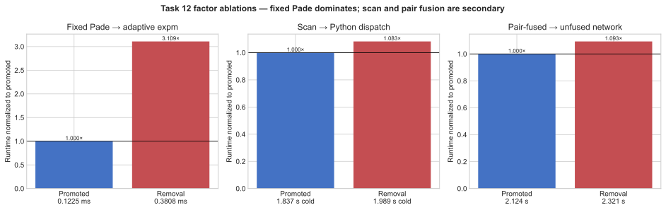

# Task 12 Autoresearch Campaign Report

## Scope and claim

This campaign optimized only ORBIT-Q Task 12, the variational-circuit to
DMRG-MPS overlap workload (32 qubits, two SU4 brickwork layers, 465
parameters, exactly 5000 Adam updates). It compares the immutable
human-expert reference with one candidate (`e01`) and one tracked
reference-derived variant, all measured with this repository's `./bench`
harness in the pinned lock environment.

No matched external implementation publishes runtime for this exact
workload, evaluator, and allocation. The optimized source is therefore
called the **campaign-best implementation**, not a global SOTA
implementation.

The campaign establishes a statistically valid local-engine runtime
improvement of 3.914x (candidate) and 4.248x (tracked variant). The campaign
host has no Docker daemon, so the formal `GOAL.md` Gate 3 Docker protocol
did not run here; a Docker-engine rerun of the same six-pair protocol is the
single missing step for formal promotion. It does not reach the 10x stretch
target.

| Role | Artifact | Commit or hash |
|---|---|---|
| Immutable expert | [`references/task-12/solution_12.py`](../../references/task-12/solution_12.py) | SHA-256 `10cfd516bc250633f4675653e0d8986002e56f4d5916a9c2972c1085193f5d38` |
| Campaign best (candidate e01) | [`src/solutions/task-12/solution_12.py`](../../src/solutions/task-12/solution_12.py) | SHA-256 `1d9a36c2649e938666f680e98e423e966f82c503da64ce7e4e06c5e33344560a` |
| Tracked variant | [`src/solutions/task-12/variants/solution_12_fused.py`](../../src/solutions/task-12/variants/solution_12_fused.py) | SHA-256 `5edd437829352c573b24ae2f9021ef6046c2cf53788a8b79c8811b8fe0e3103f` |
| Candidate hypothesis | Experiment `e01` | Commit `ef005888101c98de30fda2df3331f5f8461bf0ab` |
| Candidate evidence | Six paired runs | Report SHA-256 `653aaaaabff79a4c9a2bdcdbea4a82b561d8cff0824b83f84df08f5efb2659cd` |
| Variant evidence | Six paired runs | Report SHA-256 `f7bc804a975b299a786b6bc519764a2dd926076e054d82d9aea20094cc0abed8` |
| Workload | `datasets/public/task-12/canonical.json`, dataset `orbitq-workloads-v20260728.2` | Expert validation report SHA-256 `6d15f64bdf03097f1423fa16e0f434c97b2d1e44dafd5973abec0e08df004975` |

## Campaign-best result

Experiment e01 made two execution changes and no protocol changes:

1. All 31 SU4 gate matrices are built per step with one einsum against the
   stacked su(4) generators and one batched fixed 2^5 scaling-and-squaring
   diagonal Pade(3,3) matrix exponential, applied through `circuit.any`.
2. All 5000 Adam updates run inside a single `jax.lax.scan`.

All 12 evaluator cells passed. The candidate won all six matched pairs.

| Metric | Immutable expert | Campaign best (e01) | Tracked fused variant |
|---|---:|---:|---:|
| Passing runs | 6/6 (both sessions) | 6/6 | 6/6 |
| Mean runtime | 9.082742 s / 9.020622 s (per session) | 2.320613 s | 2.123708 s |
| Median runtime | 9.086063 s / 9.033664 s | 2.320519 s | 2.121520 s |
| Runtime standard error | 0.027423 s / 0.026975 s | 0.002886 s | 0.004555 s |
| Mean paired speedup | — | 3.914003x | 4.247771x |
| Paired-speedup standard error | — | 0.014572x | 0.019961x |
| 95% Student-t interval | — | 3.876545x–3.951460x | 4.196459x–4.299083x |
| Ratio-of-means improvement | — | 74.450306% | 76.457192% |

Matched timings, candidate session (order alternates `reference->candidate`
/ `candidate->reference`):

| Pair | Order | Reference | Candidate | Speedup |
|---:|---|---:|---:|---:|
| 1 | reference → candidate | 9.132 s | 2.324 s | 3.9299x |
| 2 | candidate → reference | 9.040 s | 2.317 s | 3.9023x |
| 3 | reference → candidate | 9.023 s | 2.318 s | 3.8926x |
| 4 | candidate → reference | 9.163 s | 2.311 s | 3.9651x |
| 5 | reference → candidate | 9.132 s | 2.323 s | 3.9312x |
| 6 | candidate → reference | 9.006 s | 2.331 s | 3.8629x |

The complete evidence is recorded in [`LOG.md`](LOG.md), with distilled
lessons in [`INSIGHTS.md`](INSIGHTS.md).

## Implementation

### Batched fixed-order su(4) exponentials

The expert builds each of the 31 SU4 gates separately:
`tc.gates.su4_gate` chains 15 scalar multiply/stack operations and one
norm-adaptive Pade-13 `jax.scipy.linalg.expm` per gate, and the whole chain
is differentiated. The campaign-best implementation builds every generator
in one einsum and exponentiates the whole `(31, 4, 4)` batch at once:

```python
a = jnp.einsum("gi,iab->gab", thetas.astype(gens.dtype), gens) / 32j
a2 = a @ a
odd = a @ (a2 + 60.0 * eye)
even = 12.0 * a2 + 120.0 * eye
r = jnp.linalg.solve(even - odd, even + odd)   # diagonal Pade(3,3)
for _ in range(5):
    r = r @ r                                   # undo the 2**5 scaling
```

A diagonal Pade approximant of an anti-Hermitian argument is exactly unitary
(Cayley-type transform), so the gates stay exactly unitary; the fixed-order
approximation only perturbs *which* unitary, by at most 3.2e-6 for generator
norms up to 33.6 (`profiles/expm-microbench.json`), while the training
trajectory never exceeds norm 3.61 (`profiles/equivalence-check.json`).
The static graph replaces the adaptive expm's norm estimate, branch logic,
and per-gate chains: StableHLO shrinks from 8884 to 954 lines, XLA compile
from ~3.4 s to ~0.4 s, and the measured gate-build-plus-Adam scan step from
0.381 ms to 0.123 ms (`profiles/reference-profile.json`,
`profiles/expm-microbench.json`).

### Whole-training scan

The expert JIT-compiles one update and dispatches it from Python 5000 times.
The campaign-best implementation compiles the same sequential Adam process
as one `jax.lax.scan`, returning all pre-update losses, fidelities, and
overlaps as stacked scan outputs. Dispatch is only ~5 us per step, so the
scan matters mainly because the optimized step itself is ~0.19 ms.

### Tracked variant: pair-fused ququart contraction

`variants/solution_12_fused.py` additionally contracts the depth-2 brickwork
as a depth-1 chain on 16 four-level sites (`tc.QuditCircuit(16, dim=4)`):
layer-1 gates become single-site unitaries with the Neel preparation folded
in as a constant basis permutation, layer-2 gates become two-site
`I2 (x) SU4 (x) I2` unitaries, and the DMRG target is pair-fused once
outside the loop into a `tc.quantum.QuVector` bra. Every contraction result
is unchanged; the network has half the nodes. After the gate-construction
fix this buys a further ~8% end to end (4.248x vs 3.914x), confirming the
contraction was never the dominant cost.

## Preserved scientific work

The reference, candidate, and variant all:

- start from the Neel product state `|0101...01>` on 32 qubits;
- apply the same 31 trainable SU4 gates on the same brickwork bonds with the
  same 15-generator su(4) parameterization in the same generator order;
- compute the loss as the direct tensor-network overlap between the
  evaluator-provided DMRG-MPS bra and the circuit ket (no target-preparation
  circuit, no oracle values);
- draw the identical seeded float32 initialization
  (`default_rng(2039)`, scale 0.02);
- run exactly 5000 sequential Adam updates at learning rate 0.02 and record
  pre-update loss and fidelity for every step;
- return `loss_history (5000,)`, `fidelity_history (5000,)`,
  `final_parameters (465,)`, and `final_overlap_phase` as NumPy data;
- use complex64 TensorCircuit/JAX semantics in the pinned environment.

Trajectory equivalence was audited directly
(`profiles/equivalence-check.json`): from the identical initialization the
candidate's first 10 recorded losses match the reference bit-for-bit in
float32, and the deviation after 400 steps (1.27e-03) is the ordinary
round-off scale amplified by optimizer dynamics — the same order as the
reference's own run-to-run scatter of final fidelities (0.86855–0.87016
across the recorded sessions).

## Profiling interpretation

The immutable expert spends ~60% of its end-to-end time before the first
optimizer step: ~1.7 s of jit trace and ~3.4 s of XLA compile for an
8884-line StableHLO module, dominated by the 31 separate `su4` construction
chains; the 5000-step loop runs at ~0.67 ms per step, of which the batched
gate construction alone accounts for ~0.38 ms and the tensor-network
contraction is nearly free (the exact circuit state has bond dimension at
most 4). The evidence supports gate-construction batching with a fixed-order
exponential as the main improvement; the scan and the pair-fused network
address the remaining dispatch and node-count overheads.

## Factor ablation addendum

The original e01 result bundled fixed batched SU4 construction with the
whole-training scan. The tracked ququart variant already provides a clean
incremental contraction ablation. A post-merge scan-removal profile completes
the attribution:

| Factor | Control | Removal or alternative | Measured contribution | Numerical check |
|---|---:|---:|---:|---:|
| Fixed batched Pade gate construction | 0.1225 ms per gate-build/grad/Adam kernel | 0.3808 ms with adaptive Pade-13 expm | adaptive/fixed `3.109x` for the isolated kernel | candidate error envelope already audited |
| Whole-training scan | 0.9131 s mean for 5000 steps | 1.1596 s with 5000 dispatches of the identical compiled step | loop/scan `1.270x` in execution; cold lower+compile+execute improves only 7.66% | all histories and parameters bitwise equal |
| Pair-fused ququart contraction | 2.3206 s canonical candidate mean | 2.1237 s tracked-variant mean | 8.49% lower end to end; `1.093x` incremental | 12/12 cells PASS |

The factors are not additive because cold compilation and execution overlap in
the end-to-end timer. Still, their relative scale is clear: the fixed batched
gate construction is the dominant source of the `3.914x` candidate gain.
The scan saves about 0.25 s of 5000-step execution but only about 0.15 s after
its slightly larger cold compile boundary is included. Pair fusion is another
roughly 8.5% end-to-end refinement. The report no longer credits all three
items equally.

Reproduction and sanitized output:

- [`profile_factor_ablation.py`](profile_factor_ablation.py)
- [`profiles/factor-ablation.json`](profiles/factor-ablation.json)



Each panel removes one factor and normalizes runtime to the promoted form.
The scan panel uses cold lower+compile+execute time, matching the end-to-end
evaluation emphasis. Regenerate with
[`plot_factor_ablation.py`](plot_factor_ablation.py).

## Final-rerun status

The paired sessions recorded above are the final local-engine benchmarks for
this campaign; no tuning followed them. The formal `GOAL.md` Docker
promotion protocol (one pinned container, six counterbalanced pairs,
`--engine docker`) has not run because this host has no Docker daemon. The
single remaining step for formal promotion is:

```bash
./bench env build tensorcircuit-py311
./bench run 12 --solution optimized --compare-to reference \
  --repeat 6 --engine docker --timeout 300 --no-build \
  --output results/task-12-e01-docker-promotion
```

on a Docker-capable host, expecting the same qualitative outcome.

## Limits and next work

- Local-engine evidence only; the Docker gate is deferred as above.
- One host (4 vCPU Intel Xeon cloud VM); no scaling claim; the fixed
  workload prevents scale probes by contract.
- Python 3.12.3 with the exact lock versions (the pinned image ships
  Python 3.11); a Docker rerun removes this deviation.
- The 10x stretch target would need a candidate mean near 0.91 s in the e01
  session; the measured campaign-best mean is 2.12 s (fused variant). The
  remaining time is roughly 1.15 s of one-time trace/compile, 0.95 s of
  optimizer steps, and 0.12 s of target conversion, so a 10x path would have
  to attack XLA compile latency itself or amortize compilation across runs,
  which the cold-cache measurement rule intentionally forbids.
